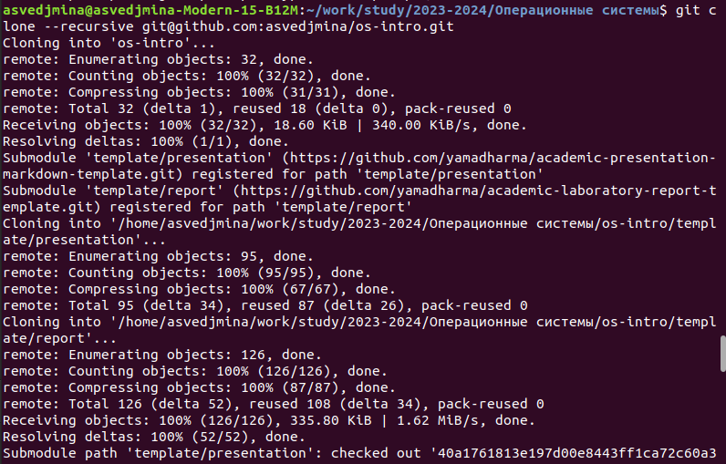

---
## Front matter
lang: ru-RU
title: Презентация к лабораторной работе №2
subtitle: Операционные системы
author:
  - Ведьмина А.С.
teacher:
  - Демидова А.В.
institute:
  - Российский университет дружбы народов, Москва, Россия

## i18n babel
babel-lang: russian
babel-otherlangs: english

## Formatting pdf
toc: false
toc-title: Содержание
slide_level: 2
aspectratio: 169
section-titles: true
theme: metropolis
header-includes:
 - \metroset{progressbar=frametitle,sectionpage=progressbar,numbering=fraction}
 - '\makeatletter'
 - '\beamer@ignorenonframefalse'
 - '\makeatother'
---

## Цели и задачи

- Изучить идеологию и применение средств контроля версий. Освоить работу с гит.
- Создать каталог для выполнения заданий курса

# Ход работы

## Создание репозитория курса на основе шаблона

Репозиторий-шаблон: <https://github.com/yamadharma/course-directory-student-template>

Создаю репозиторий по шаблону.

## Клонирование репозитория на компьтер

Создаю папку "Операционные системы" в work/study/2023-2024.
Клонирую в неё репозиторий с гитхаба и удаляю все файлы типа json.

## Создание структуры каталога

Создаю требуемую структуру каталога с помощью команды make, после чего загружаю все изменения на гитхаб.

# Результаты

В ходе лабораторной работы я освоила навыки работы с git и создала каталог для выполнения заданий на курсе.
