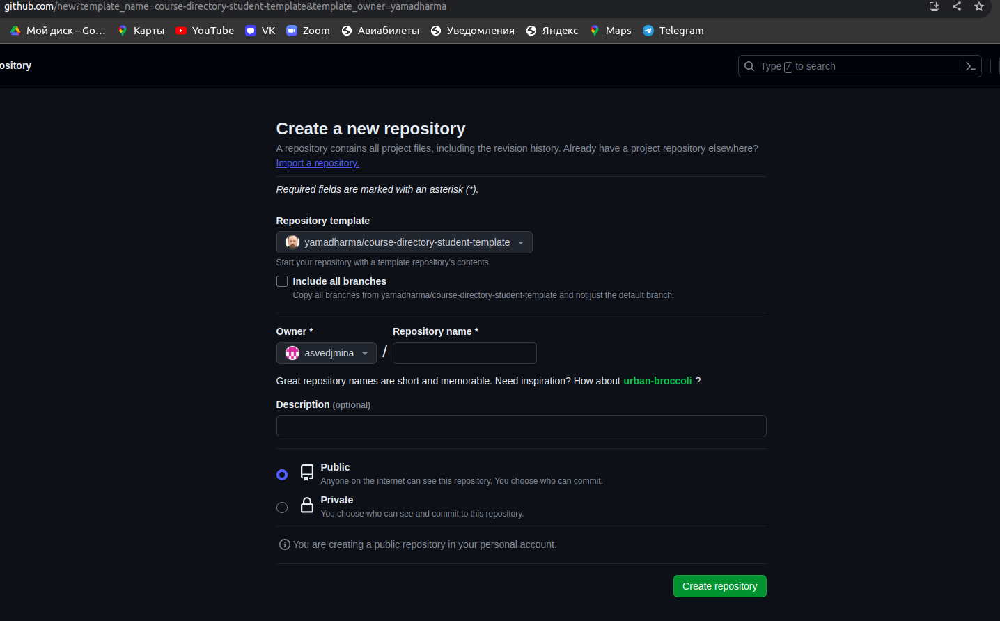
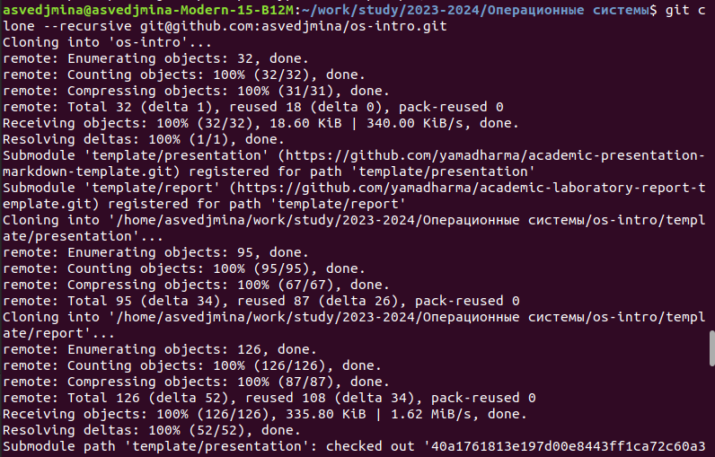
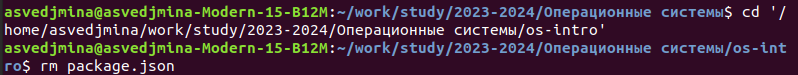
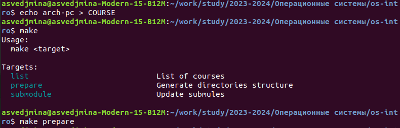
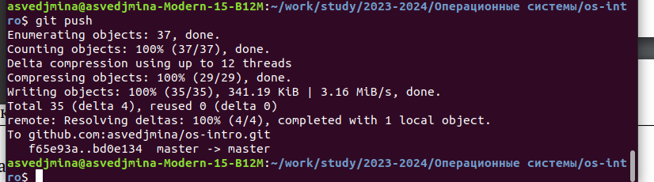

---
## Front matter
title: "Отчёт по лабораторной работе №2"
subtitle: "Операционные системы"
author: "Ведьмина Александра Сергеевна"

## Generic otions
lang: ru-RU
toc-title: "Содержание"

## Bibliography
bibliography: bib/cite.bib
csl: pandoc/csl/gost-r-7-0-5-2008-numeric.csl

## Pdf output format
toc: true # Table of contents
toc-depth: 2
lof: true # List of figures
lot: true # List of tables
fontsize: 12pt
linestretch: 1.5
papersize: a4
documentclass: scrreprt
## I18n polyglossia
polyglossia-lang:
  name: russian
  options:
	- spelling=modern
	- babelshorthands=true
polyglossia-otherlangs:
  name: english
## I18n babel
babel-lang: russian
babel-otherlangs: english
## Fonts
mainfont: PT Serif
romanfont: PT Serif
sansfont: PT Sans
monofont: PT Mono
mainfontoptions: Ligatures=TeX
romanfontoptions: Ligatures=TeX
sansfontoptions: Ligatures=TeX,Scale=MatchLowercase
monofontoptions: Scale=MatchLowercase,Scale=0.9
## Biblatex
biblatex: true
biblio-style: "gost-numeric"
biblatexoptions:
  - parentracker=true
  - backend=biber
  - hyperref=auto
  - language=auto
  - autolang=other*
  - citestyle=gost-numeric
## Misc options
indent: true
header-includes:
  - \usepackage{indentfirst}
  - \usepackage{float} # keep figures where there are in the text
  - \floatplacement{figure}{H} # keep figures where there are in the text
---

# Цель работы

Изучить идеологию и применение средств контроля версий. Освоить работу с гит.

# Задание

1. Ознакомиться с теоретическим введением.
2. Создать репозиторий на гитхаб по имеющемуся шаблону.

# Теоретическое введение

Система контроля версий Git представляет собой набор программ командной строки. Доступ к ним можно получить из терминала посредством ввода команды git с различными опциями.

В классических системах контроля версий используется централизованная модель, предполагающая наличие единого репозитория для хранения файлов. Выполнение большинства функций по управлению версиями осуществляется специальным сервером. Участник проекта (пользователь) перед началом работы посредством определённых команд получает нужную ему версию файлов. После внесения изменений, пользователь размещает новую версию в хранилище. При этом предыдущие версии не удаляются из центрального хранилища и к ним можно вернуться в любой момент. Сервер может сохранять не полную версию изменённых файлов, а производить так называемую дельта-компрессию — сохранять только изменения между последовательными версиями, что позволяет уменьшить объём хранимых данных.

Системы контроля версий также могут обеспечивать дополнительные, более гибкие функциональные возможности. Например, они могут поддерживать работу с несколькими версиями одного файла, сохраняя общую историю изменений до точки ветвления версий и собственные истории изменений каждой ветви. Кроме того, обычно доступна информация о том, кто из участников, когда и какие изменения вносил. Обычно такого рода информация хранится в журнале изменений, доступ к которому можно ограничить.

# Выполнение лабораторной работы

Я уже имею репозиторий на гитхаб, поэтому приступаю сразу к созданию каталога для курса.

Создаю репозиторий с названием os-intro, переходя по "use this template" в репозитории-шаблоне.

{#fig:001 width=100%}

Создаю папку "Операционные системы" в work/study/2023-2024.
Клонирую репозиторий с гитхаба.

{#fig:002 width=100%}

Удаляю все файлы типа json.

{#fig:003 width=100%}

Создаю требуемую структуру каталога с помощью команды make.

{#fig:004 width=100%}

Загружаю все изменения на гитхаб.

{#fig:005 width=100%}

# Выводы

В ходе лабораторной работы я освоила навыки работы с git и создала каталог для выполнения заданий на курсе.

# Ответы на контрольные вопросы

1. Что такое системы контроля версий (VCS) и для решения каких задач они предназначаются?

Системы контроля версий (Version Control System, VCS) применяются при работе нескольких человек над одним проектом. Обычно основное дерево проекта хранится в локальном или удалённом репозитории, к которому настроен доступ для участников проекта. При внесении изменений в содержание проекта система контроля версий позволяет их фиксировать, совмещать изменения, произведённые разными участниками проекта, производить откат к любой более ранней версии проекта, если это требуется.

2. Объясните следующие понятия VCS и их отношения: хранилище, commit, история, рабочая копия.

Хранилище - единый репозиторий для хранения файлов. Commit позволяет сохранять все добавленные изменения и все изменённые файлы. История - история изменений, внесённых в проект. Рабочая копия - копия с которой непосредственно работают.

3. Что представляют собой и чем отличаются централизованные и децентрализованные VCS? Приведите примеры VCS каждого вида.

При централизованной VCS репозиторий хранится на одном сервере, все разработчики работают с ним (например, Apache Subversion). В децентрализованных VCS каждый пользователь имеет локальную копию всей истории работы (например, Monotone).

4. Опишите действия с VCS при единоличной работе с хранилищем.

Создание локальной копии репозитория, внесение изменений в неё, коммит изменений в репозиторий.

5. Опишите порядок работы с общим хранилищем VCS.

Клонирование репозитория, внесение изменений в проект, коммит изменений в репозиторий, отправка их в общий репозиторий.

6. Каковы основные задачи, решаемые инструментальным средством git?

Фиксировать, совмещать изменения, произведённые разными участниками проекта,
производить откат к любой более ранней версии проекта, если это требуется.

7. Назовите и дайте краткую характеристику командам git.

git init - создание основного дерева репозитория
git pull - получение обновлений (изменений) текущего дерева из центрального
репозитория
git push - отправка всех произведённых изменений локального дерева в
центральный репозиторий
git status - просмотр списка изменённых файлов в текущей директории
git diff - просмотр текущих изменения
git add . - добавить все изменённые и/или созданные файлы и/или каталоги
git add имена_файлов - добавить конкретные изменённые и/или созданные файлы и или каталоги
git rm имена_файлов - удалить файл и/или каталог из индекса репозитория
и другие

8. Приведите примеры использования при работе с локальным и удалённым репозиториями.

git add .
git commit -am 'feat(main): make course structure'

9. Что такое и зачем могут быть нужны ветви (branches)?

Ветви - версии одного файла, имеющие общую историю изменений до точки ветвления версий и
собственные истории изменений каждой ветви. 

10. Как и зачем можно игнорировать некоторые файлы при commit?

Чтобы игнорировать некоторые файлы при коммите в VCS, можно использовать файл .gitignore (для Git).

