---
## Front matter
lang: ru-RU
title: Лабораторная работа №4
subtitle: операционные системы
author:
  - Ведьмина А.С.
institute:
  - Российский университет дружбы народов, Москва, Россия

## i18n babel
babel-lang: russian
babel-otherlangs: english

## Formatting pdf
toc: false
toc-title: Содержание
slide_level: 2
aspectratio: 169
section-titles: true
theme: metropolis
header-includes:
 - \metroset{progressbar=frametitle,sectionpage=progressbar,numbering=fraction}
 - '\makeatletter'
 - '\beamer@ignorenonframefalse'
 - '\makeatother'
---

# Информация

## Докладчик

:::::::::::::: {.columns align=center}
::: {.column width="70%"}

  * Ведьмина Александра Сергеевна
  * факультет физико-математических и естественных наук
  * студентка
  * Российский университет дружбы народов
  * [1132236003@rudn.ru]
  * <https://AlVed.github.io/ru/>

:::
::: {.column width="30%"}

:::
::::::::::::::

# Вводная часть

## Цели и задачи

Получение навыков правильной работы с репозиториями git.

1. Ознакомиться с теоретическим введением в git flow.
2. Создать учебный репозиторий.
3. Сделать несколько релизов.

## Теоретическое введение

Модель Gitflow включает в себя следующую последовательность действий:

1. Из ветки master создаётся ветка develop.
2. Из ветки develop создаётся ветка release.
3. Из ветки develop создаются ветки feature.
4. Когда работа над веткой feature завершена, она сливается с веткой develop.
5. Когда работа над веткой релиза release завершена, она сливается в ветки develop и master.
6. Если в master обнаружена проблема, из master создаётся ветка hotfix.
7. Когда работа над веткой исправления hotfix завершена, она сливается в ветки develop и master.

# Выполнение лабораторной работы

## Установка программного обеспечения

Устанавливаю git-flow.

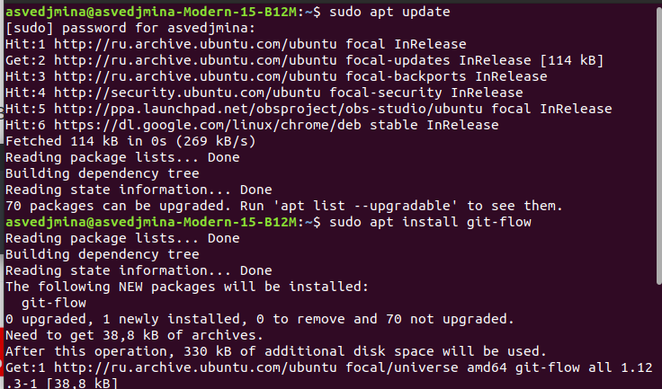{#fig:001 width=100%}

## Установка программного обеспечения

Загружаю Node.js.

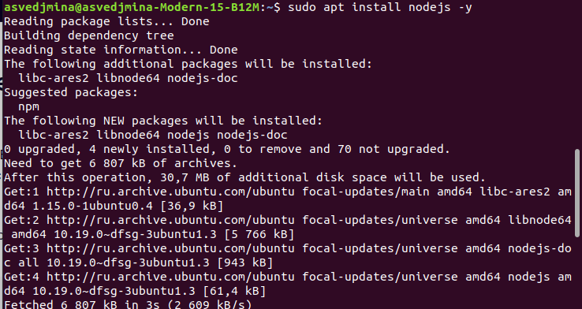{#fig:002 width=100%}

## Установка программного обеспечения

Устанавливаю программы для форматирования коммитов и создания логов.

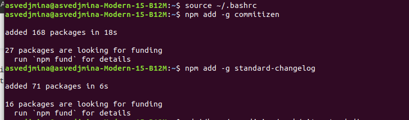{#fig:003 width=100%}

## Работа с репозиторием git-extended

Создаю репозиторий git-extended. Делаю первый коммит и выкладываю на гитхаб.
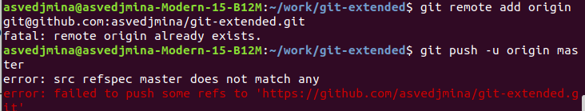{#fig:004 width=100%}

## Работа с репозиторием git-extended

Произвожу конфигурацию пакетов node.js.

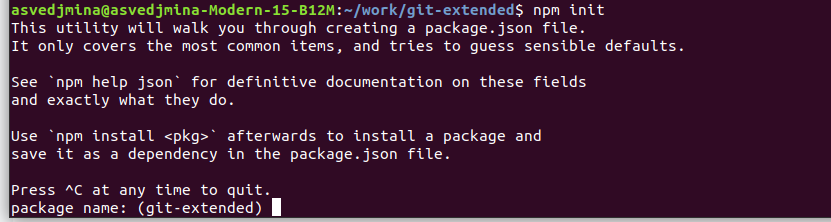{#fig:005 width=100%}

## Работа с репозиторием git-extended

Заполняю название пакета и лицензию (CC-BY-4.0), теперь package.json выгялдит следующим образом

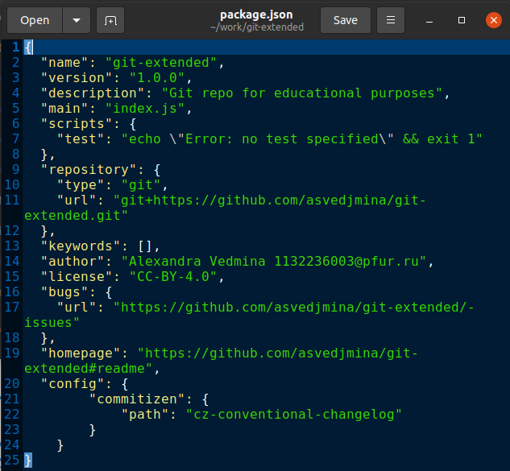{#fig:006 width=100%}

## Работа с репозиторием git-extended

Добавляю новые файлы, выполняю коммит и отправляю всё на гитхаб.

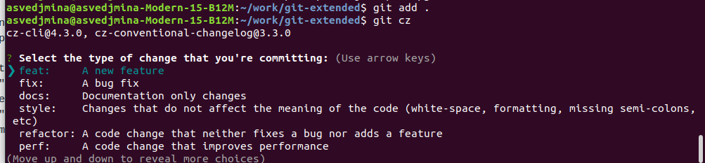{#fig:007 width=100%}

## Работа с git-flow

Инициализирую git-flow, загружаю весь репозиторий в хранилище.

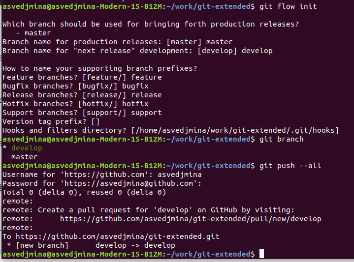{#fig:008 width=100%}

## Работа с git-flow

Создаю релиз с версией 1.0.0.

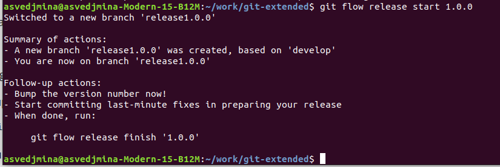{#fig:009 width=100%}

## Работа с git-flow

Создаю журнал изменений, добавляю его в индекс и заливаю релизную ветку в основную.

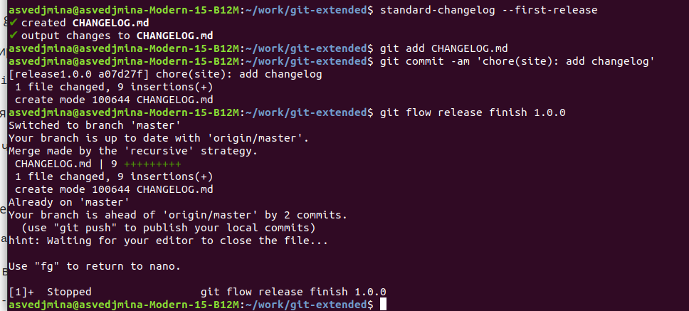{#fig:010 width=100%}

## Работа с git-flow

Отправляю все изменения на гитхаб.

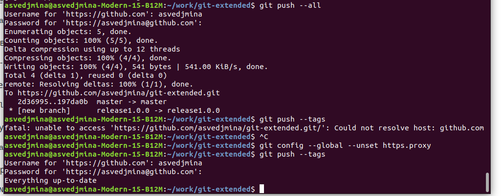{#fig:011 width=100%}

## Работа с релизом 1.0.0

Создаю релиз 1.0.0 на гитхаб.

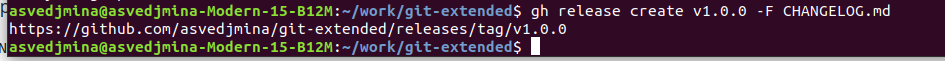{#fig:012 width=100%}

## Работа с релизом 1.0.0

Создаю ветку для новой функциональности, а после объединяю ветку feature с develop.

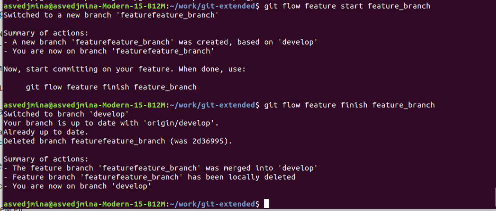{#fig:013 width=100%}

## Работа с релизом 1.2.3

Создаю релиз с версией 1.2.3.

{#fig:014 width=100%}

## Работа с релизом 1.2.3

Обновляю номер версии в package.json.

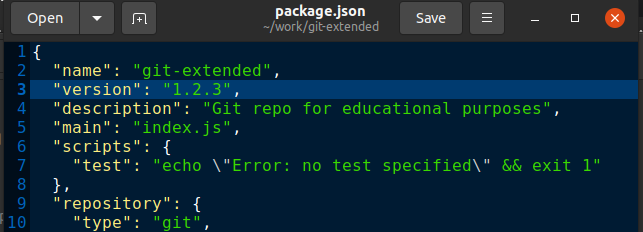{#fig:015 width=100%}

## Работа с релизом 1.2.3

Создаю журнал изменений, добавляю его в индекс, после чего заливаю ветку в основную.

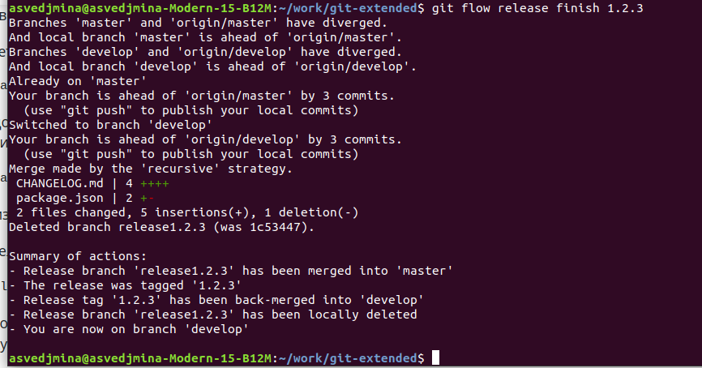{#fig:016 width=100%}

## Работа с релизом 1.2.3

Отправляю всё на гитхаб.

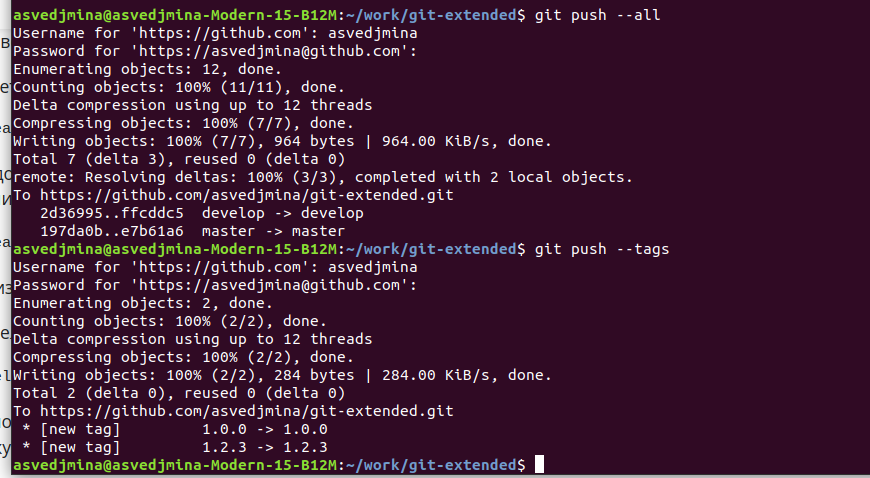{#fig:017 width=100%}

## Работа с релизом 1.2.3

Загружаю релиз 1.2.3 на гитхаб.

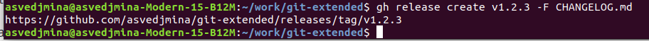{#fig:018 width=100%}

# Выводы

В ходе лабораторной работы я освоила навыки углубленной работы с репозиторием git.
