---
## Front matter
title: "Отчёт по лабораторной работе №4"
subtitle: "Операционные системы"
author: "Ведьмина Александра Сергеевна"

## Generic otions
lang: ru-RU
toc-title: "Содержание"

## Bibliography
bibliography: bib/cite.bib
csl: pandoc/csl/gost-r-7-0-5-2008-numeric.csl

## Pdf output format
toc: true # Table of contents
toc-depth: 2
lof: true # List of figures
lot: true # List of tables
fontsize: 12pt
linestretch: 1.5
papersize: a4
documentclass: scrreprt
## I18n polyglossia
polyglossia-lang:
  name: russian
  options:
	- spelling=modern
	- babelshorthands=true
polyglossia-otherlangs:
  name: english
## I18n babel
babel-lang: russian
babel-otherlangs: english
## Fonts
mainfont: PT Serif
romanfont: PT Serif
sansfont: PT Sans
monofont: PT Mono
mainfontoptions: Ligatures=TeX
romanfontoptions: Ligatures=TeX
sansfontoptions: Ligatures=TeX,Scale=MatchLowercase
monofontoptions: Scale=MatchLowercase,Scale=0.9
## Biblatex
biblatex: true
biblio-style: "gost-numeric"
biblatexoptions:
  - parentracker=true
  - backend=biber
  - hyperref=auto
  - language=auto
  - autolang=other*
  - citestyle=gost-numeric
## Pandoc-crossref LaTeX customization
figureTitle: "Рис."
tableTitle: "Таблица"
listingTitle: "Листинг"
lofTitle: "Список иллюстраций"
lotTitle: "Список таблиц"
lolTitle: "Листинги"
## Misc options
indent: true
header-includes:
  - \usepackage{indentfirst}
  - \usepackage{float} # keep figures where there are in the text
  - \floatplacement{figure}{H} # keep figures where there are in the text
---

# Цель работы

Получение навыков правильной работы с репозиториями git.

# Задание

1. Ознакомиться с теоретическим введением в git flow.
2. Создать учебный репозиторий.
3. Сделать несколько релизов.

# Теоретическое введение

Gitflow Workflow опубликована и популяризована Винсентом Дриссеном. Она предполагает выстраивание строгой модели ветвления с учётом выпуска проекта и отлично подходит для организации рабочего процесса на основе релизов.

Модель Gitflow включает в себя следующую последовательность действий:

1. Из ветки master создаётся ветка develop.
2. Из ветки develop создаётся ветка release.
3. Из ветки develop создаются ветки feature.
4. Когда работа над веткой feature завершена, она сливается с веткой develop.
5. Когда работа над веткой релиза release завершена, она сливается в ветки develop и master.
6. Если в master обнаружена проблема, из master создаётся ветка hotfix.
7. Когда работа над веткой исправления hotfix завершена, она сливается в ветки develop и master.

# Выполнение лабораторной работы

Устанавливаю git-flow.

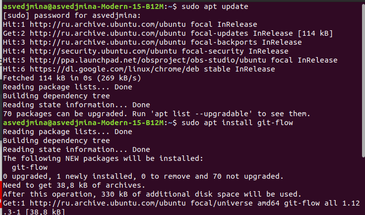{#fig:001 width=100%}

Загружаю Node.js.

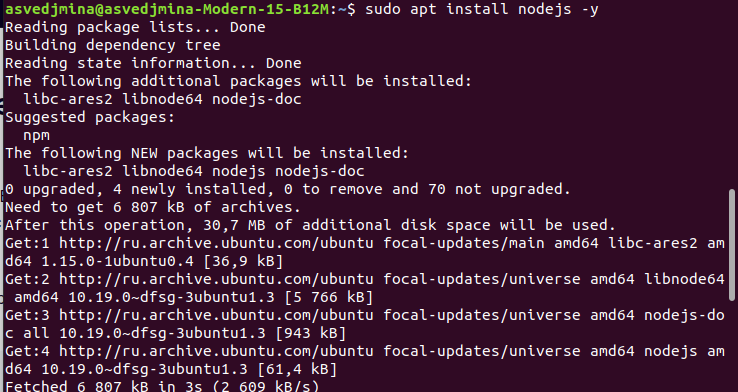{#fig:002 width=100%}

Устанавливаю программы для форматирования коммитов и создания логов.

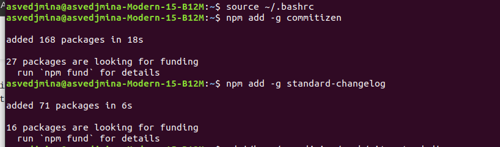{#fig:003 width=100%}

Создаю репозиторий git-extended. Делаю первый коммит и выкладываю на гитхаб.
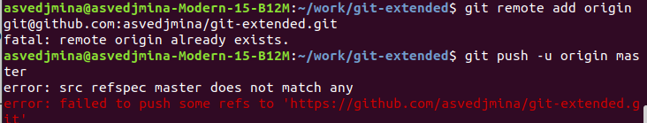{#fig:004 width=100%}

Произвожу конфигурацию пакетов node.js.

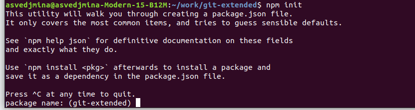{#fig:005 width=100%}

Заполняю название пакета и лицензию (CC-BY-4.0), теперь package.json выгялдит следующим образом

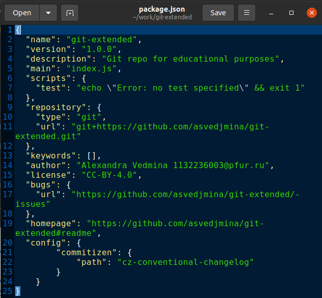{#fig:006 width=100%}

Добавляю новые файлы, выполняю коммит и отправляю всё на гитхаб.

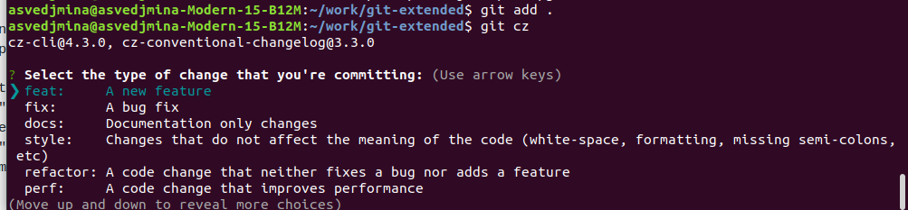{#fig:007 width=100%}

Инициализирую git-flow, загружаю весь репозиторий в хранилище.

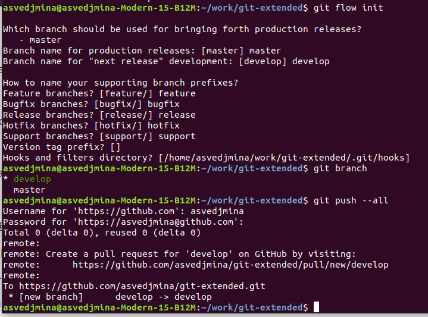{#fig:008 width=100%}

Создаю релиз с версией 1.0.0.

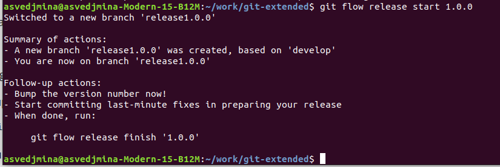{#fig:009 width=100%}

Создаю журнал изменений, добавляю его в индекс и заливаю релизную ветку в основную.

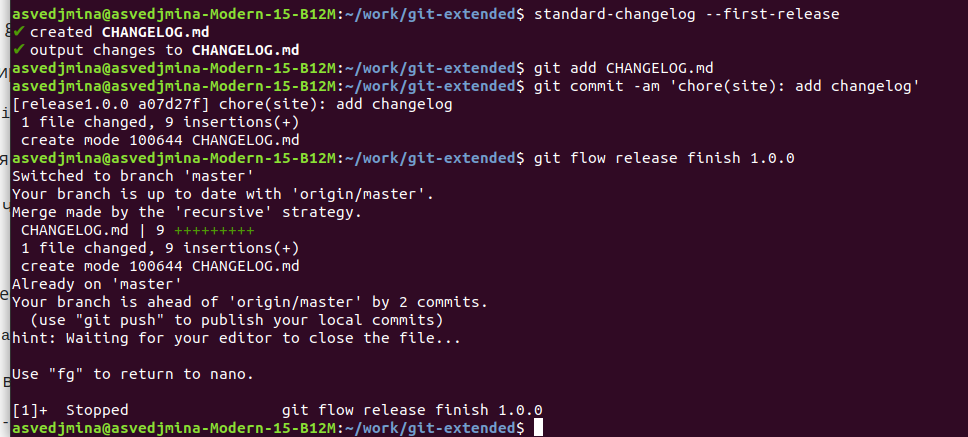{#fig:010 width=100%}

Отправляю все изменения на гитхаб.

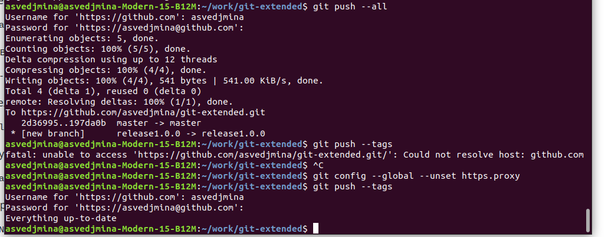{#fig:011 width=100%}

Создаю релиз 1.0.0 на гитхаб.

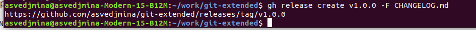{#fig:012 width=100%}

Создаю ветку для новой функциональности, а после объединяю ветку feature с develop.

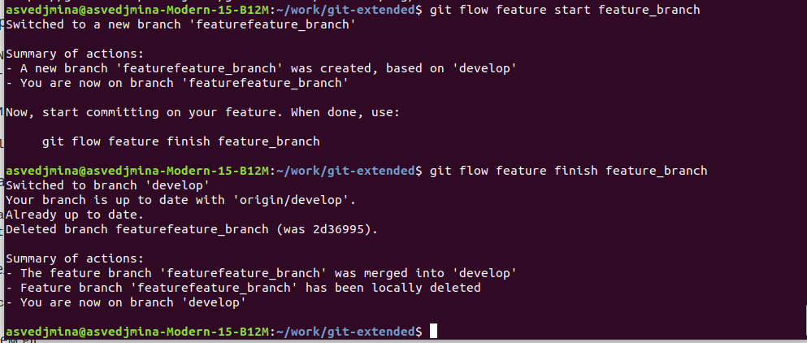{#fig:013 width=100%}

Создаю релиз с версией 1.2.3.

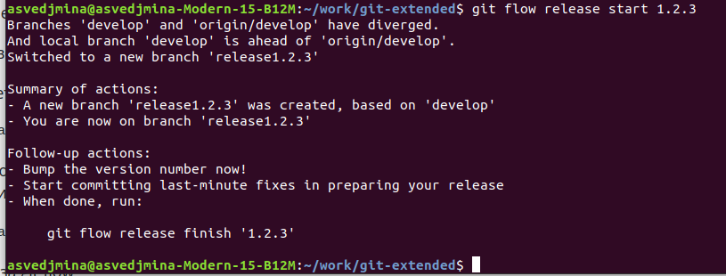{#fig:014 width=100%}

Обновляю номер версии в package.json.

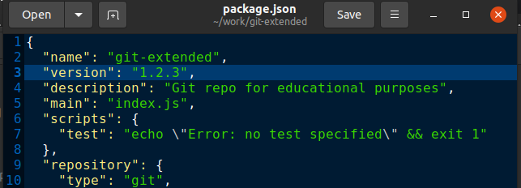{#fig:015 width=100%}

Создаю журнал изменений, добавляю его в индекс, после чего заливаю ветку в основную.

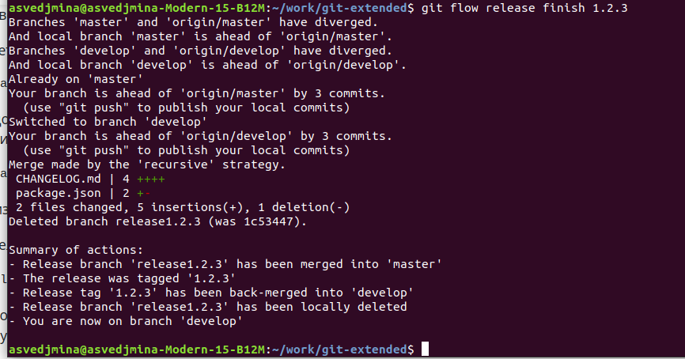{#fig:016 width=100%}

Отправляю всё на гитхаб.

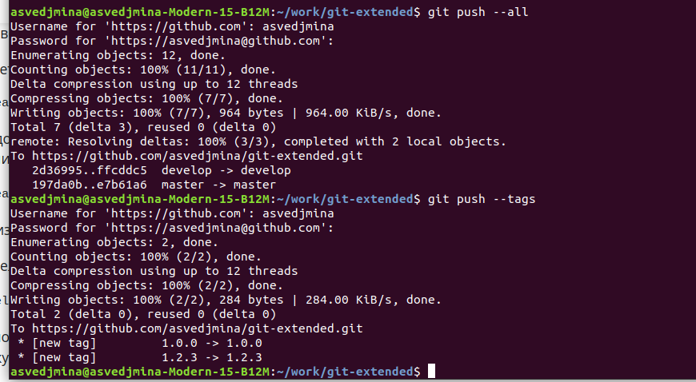{#fig:017 width=100%}

Загружаю релиз 1.2.3 на гитхаб.

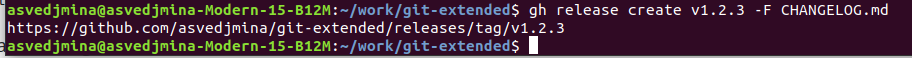{#fig:018 width=100%}

# Выводы

В ходе лабораторной работы я освоила навыки углубленной работы с репозиторием git.
