---
## Front matter
lang: ru-RU
title: Лабораторная работа №5
subtitle: операционные системы
author:
  - Ведьмина А.С.
institute:
  - Российский университет дружбы народов, Москва, Россия

## i18n babel
babel-lang: russian
babel-otherlangs: english

## Formatting pdf
toc: false
toc-title: Содержание
slide_level: 2
aspectratio: 169
section-titles: true
theme: metropolis
header-includes:
 - \metroset{progressbar=frametitle,sectionpage=progressbar,numbering=fraction}
 - '\makeatletter'
 - '\beamer@ignorenonframefalse'
 - '\makeatother'
---

# Информация

## Докладчик

:::::::::::::: {.columns align=center}
::: {.column width="70%"}

  * Ведьмина Александра Сергеевна
  * студентка
  * Российский университет дружбы народов
  * [1132236003@pfur.ru](mailto:1132236003@rudn.ru)
  * <https://asvedjmina.github.io/ru/>

:::
::: {.column width="30%"}

:::
::::::::::::::

# Вводная часть

## Цели и задачи

Цель: настройка рабочей среды с помощью менеджера паролей pass.

Задачи:

1. Установить необходимое программное обеспечение.
2. Изучить принцип работы менеджера паролей pass.
3. Установить дополнительное программное обеспечение.

## Теоретическое введение

Менеджер паролей pass создан в рамках идеалогии Unix. В нём данные хранятся в файловой системе в виде каталогов и файлов. Файлы шифруются с помощью GPG-ключа.

Структура базы паролей может быть произвольной. Если необходимо использовать дополнительное программное обеспечение, семантику необходимо заложить в структуру базы паролей.

На данный момент существует 2 основных реализации: pass и gopass.

# Выполнение лабораторной работы

## Установка программного обеспечения

Устанавливаю gopass.

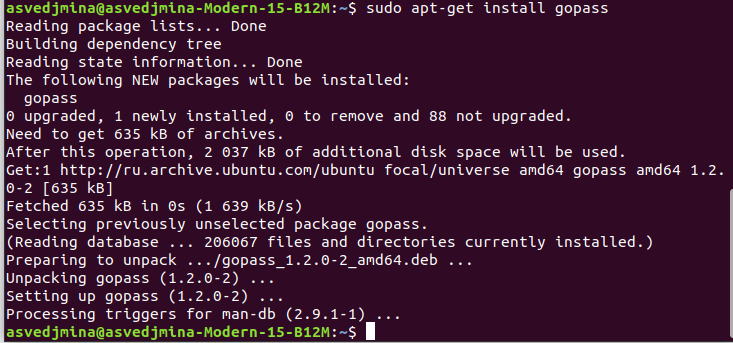{#fig:001 width=100%}

## Установка программного обеспечения

Устанавливаю менеджер паролей pass.

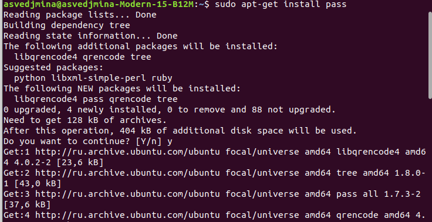{#fig:002 width=100%}

## Работа с ключами GPG

Просматриваю список имеющихся ключей. Так как список пуст, создаю новый ключ.

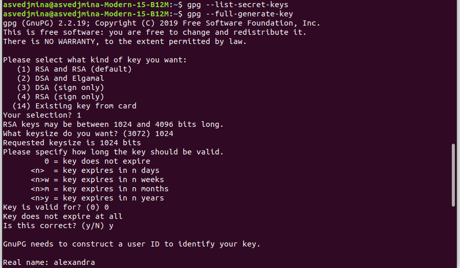{#fig:003 width=100%}

## Работа с git

Инициализирую хранилище.

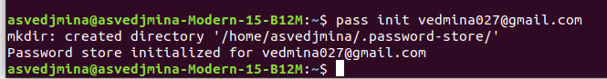{#fig:004 width=100%}

Синхранизирую хранилище с git, создавая структуру git и задавая адрес репозитория на хостинге.

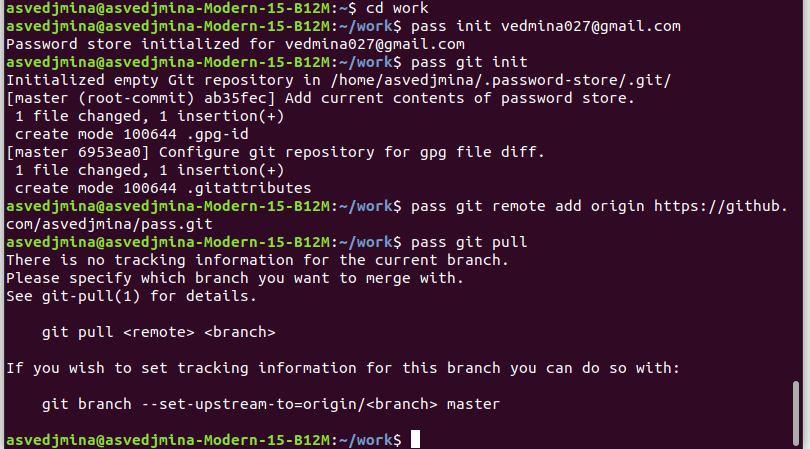{#fig:005 width=100%}

## Установка дополнительного программного обеспечения

Добавляю browserpass в Chrome.

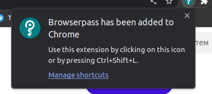{#fig:006 width=100%}

## Установка дополнительного программного обеспечения

Скачиваю browserpass c помощью sudo apt.

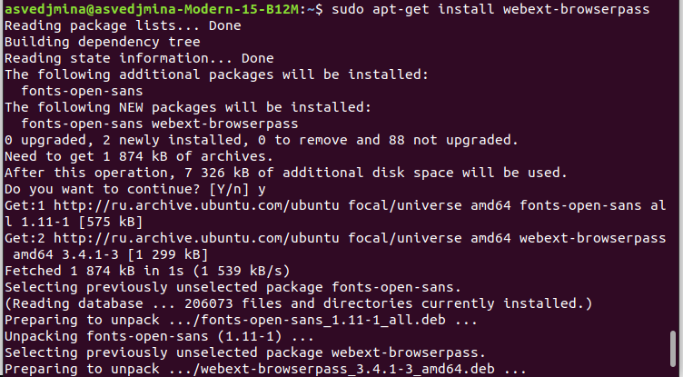{#fig:007 width=100%}

## Установка дополнительного программного обеспечения

Установка dunst.

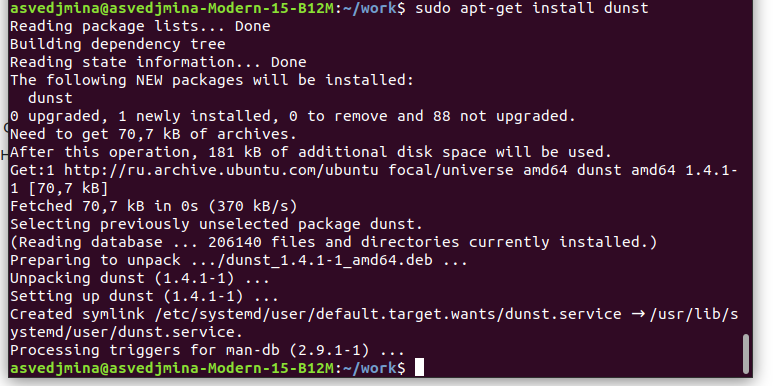{#fig:008 width=100%}

## Установка дополнительного программного обеспечения

Установка fonts-awesome.

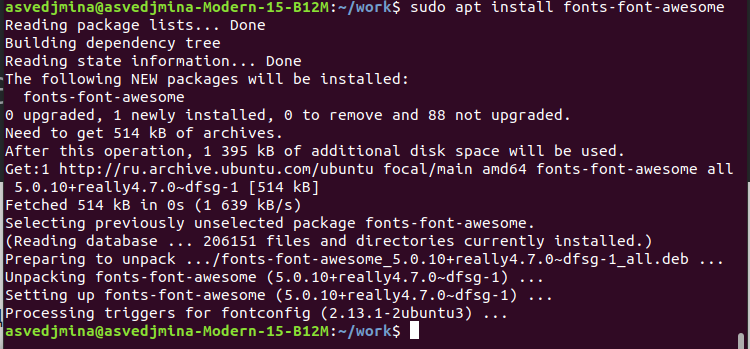{#fig:009 width=100%}

## Установка дополнительного программного обеспечения

Установка powerline-fonts.

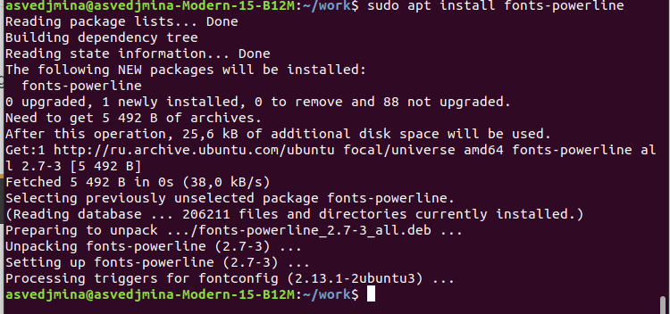{#fig:010 width=100%}

## Установка дополнительного программного обеспечения

Установка light.

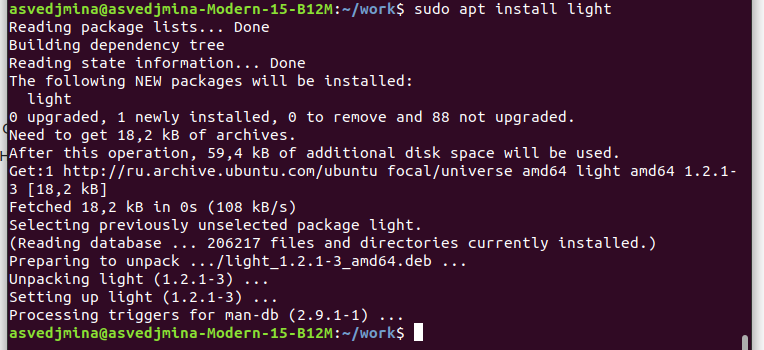{#fig:011 width=100%}

## Установка дополнительного программного обеспечения

Установка swaylock.

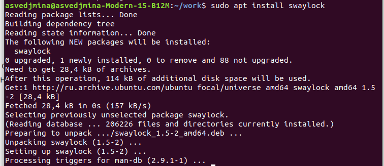{#fig:012 width=100%}

## Установка дополнительного программного обеспечения

Установка kitty.

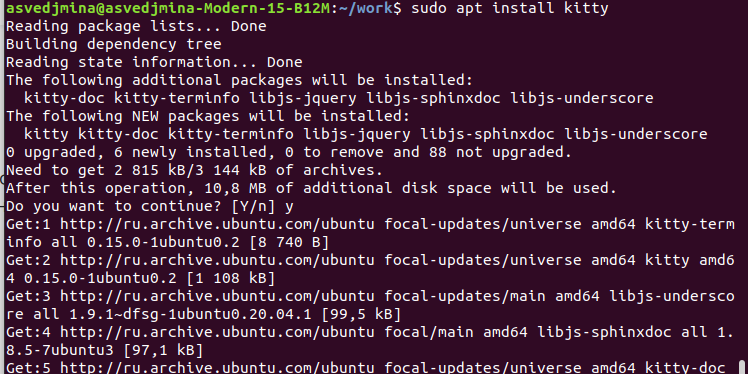{#fig:012 width=100%}

## Установка дополнительного программного обеспечения

Установка warbar swaybg.

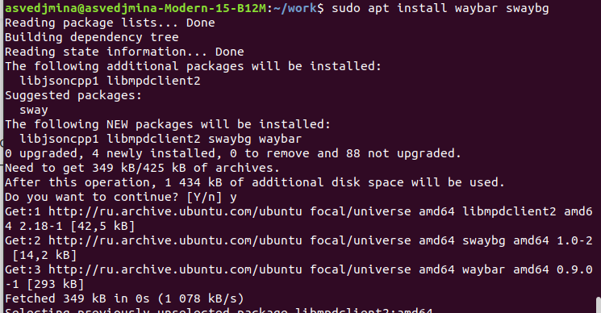{#fig:013 width=100%}

## Установка дополнительного программного обеспечения

Установка mpv.

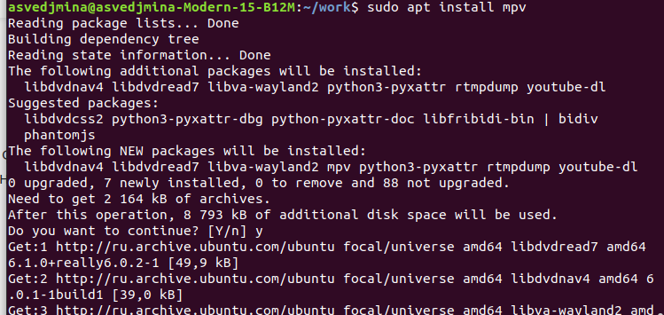{#fig:014 width=100%}

## Установка дополнительного программного обеспечения

Установка grim.

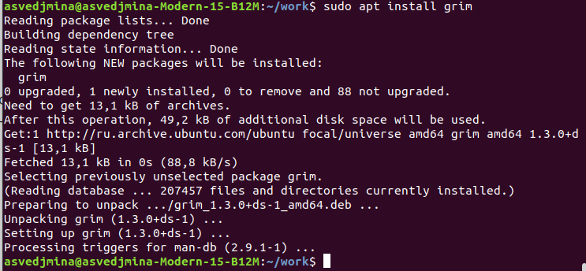{#fig:015 width=100%}

## Работа с chezmoi

Устанавливаю бинарный файл.

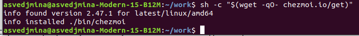{#fig:016 width=100%}

## Работа с chezmoi

Создаю свой репозиторий для конфигурационных файлов на основе шаблона.

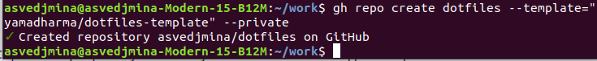{#fig:017 width=100%}

## Работа с chezmoi

Инициализирую chezmoi с моим репозиторием dotfiles.

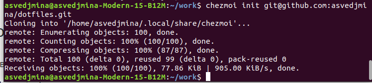{#fig:018 width=100%}

## Работа с chezmoi

Запускаю chezmoi. Просматриваю внесённые им изменения.

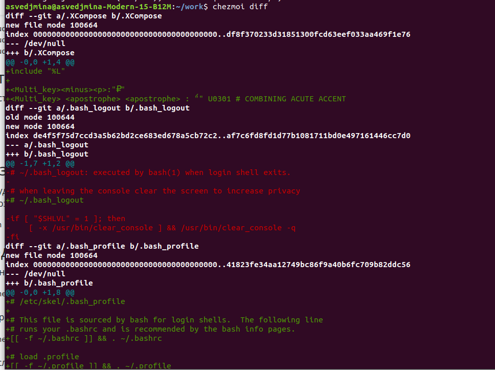{#fig:019 width=100%}

Сохраняю изменения.

# Выводы

В ходе лабораторной работы я освоила навыки использования менеджера паролей pass.
