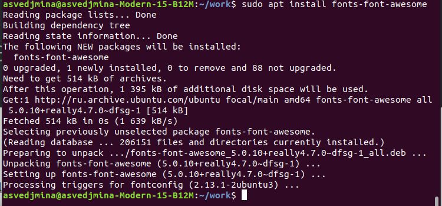

---
## Front matter
title: "Отчёт по по лабораторной работе №5"
subtitle: "Операционные системы"
author: "Ведьмина Александра Сергеевна"

## Generic otions
lang: ru-RU
toc-title: "Содержание"

## Bibliography
bibliography: bib/cite.bib
csl: pandoc/csl/gost-r-7-0-5-2008-numeric.csl

## Pdf output format
toc: true # Table of contents
toc-depth: 2
lof: true # List of figures
lot: true # List of tables
fontsize: 12pt
linestretch: 1.5
papersize: a4
documentclass: scrreprt
## I18n polyglossia
polyglossia-lang:
  name: russian
  options:
	- spelling=modern
	- babelshorthands=true
polyglossia-otherlangs:
  name: english
## I18n babel
babel-lang: russian
babel-otherlangs: english
## Fonts
mainfont: PT Serif
romanfont: PT Serif
sansfont: PT Sans
monofont: PT Mono
mainfontoptions: Ligatures=TeX
romanfontoptions: Ligatures=TeX
sansfontoptions: Ligatures=TeX,Scale=MatchLowercase
monofontoptions: Scale=MatchLowercase,Scale=0.9
## Biblatex
biblatex: true
biblio-style: "gost-numeric"
biblatexoptions:
  - parentracker=true
  - backend=biber
  - hyperref=auto
  - language=auto
  - autolang=other*
  - citestyle=gost-numeric
## Pandoc-crossref LaTeX customization
figureTitle: "Рис."
tableTitle: "Таблица"
listingTitle: "Листинг"
lofTitle: "Список иллюстраций"
lotTitle: "Список таблиц"
lolTitle: "Листинги"
## Misc options
indent: true
header-includes:
  - \usepackage{indentfirst}
  - \usepackage{float} # keep figures where there are in the text
  - \floatplacement{figure}{H} # keep figures where there are in the text
---

# Цель работы

Настройка рабочей среды с помощью менеджера паролей pass.

# Задание

1. Установить необходимое программное обеспечение.
2. Изучить принцип работы менеджера паролей pass.
3. Установить дополнительное программное обеспечение.

# Теоретическое введение

Менеджер паролей pass создан в рамках идеалогии Unix. В нём данные хранятся в файловой системе в виде каталогов и файлов. Файлы шифруются с помощью GPG-ключа.

Структура базы паролей может быть произвольной. Если необходимо использовать дополнительное программное обеспечение, семантику необходимо заложить в структуру базы паролей.

На данный момент существует 2 основных реализации: pass и gopass.

# Выполнение лабораторной работы

Устанавливаю gopass.

{#fig:001 width=100%}

Устанавливаю менеджер паролей pass.

{#fig:002 width=100%}

Просматриваю список имеющихся ключей. Так как список пуст, создаю новый ключ.

{#fig:003 width=100%}

Инициализирую хранилище.

{#fig:004 width=100%}

Синхранизирую хранилище с git, создавая структуру git и задавая адрес репозитория на хостинге.

{#fig:005 width=100%}

Добавляю browserpass в Chrome.

{#fig:006 width=100%}

Скачиваю browserpass c помощью sudo apt.

{#fig:007 width=100%}

Устанавливаю дополнительное программное обеспечение.

{#fig:008 width=100%}

{#fig:009 width=100%}

{#fig:010 width=100%}

{#fig:011 width=100%}

{#fig:012 width=100%}

{#fig:012 width=100%}

{#fig:013 width=100%}

{#fig:014 width=100%}

{#fig:015 width=100%}

Устанавливаю бинарный файл.

{#fig:016 width=100%}

Создаю свой репозиторий для конфигурационных файлов на основе шаблона.

{#fig:017 width=100%}

Инициализирую chezmoi с моим репозиторием dotfiles.

{#fig:018 width=100%}

Запускаю chezmoi. Просматриваю внесённые им изменения.

{#fig:019 width=100%}

Сохраняю изменения.

# Выводы

В ходе лабораторной работы я освоила навыки использования менеджера паролей pass.
