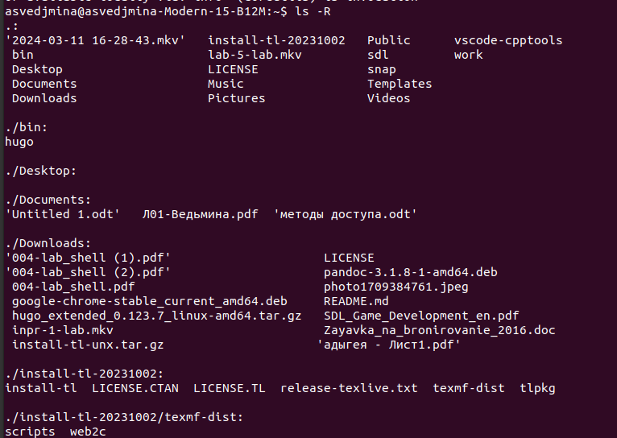

---
## Front matter
lang: ru-RU
title: Лабораторная работа №6
subtitle: операционные системы
author:
  - Ведьмина А.С.
institute:
  - Российский университет дружбы народов, Москва, Россия

## i18n babel
babel-lang: russian
babel-otherlangs: english

## Formatting pdf
toc: false
toc-title: Содержание
slide_level: 2
aspectratio: 169
section-titles: true
theme: metropolis
header-includes:
 - \metroset{progressbar=frametitle,sectionpage=progressbar,numbering=fraction}
 - '\makeatletter'
 - '\beamer@ignorenonframefalse'
 - '\makeatother'
---

# Информация

## Докладчик

:::::::::::::: {.columns align=center}
::: {.column width="70%"}

  * Ведьмина Александра Сергеевна
  * студентка
  * Российский университет дружбы народов
  * [1132236003@rudn.ru](mailto:1132236003@rudn.ru)
  * <https://asvedjmina.github.io/ru/>

:::
::: {.column width="30%"}

:::
::::::::::::::

# Вводная часть

## Цель

- Приобретение практических навыков взаимодействия пользователя с системой посредством командной строки.

## Теоретическое введение

В операционной системе типа Linux взаимодействие пользователя с системой обычно
осуществляется с помощью командной строки посредством построчного ввода ко-
манд. При этом обычно используется командные интерпретаторы языка shell: /bin/sh ;
/bin/csh ; /bin/ksh.

Командой в операционной системе называется записанный по
специальным правилам текст (возможно с аргументами), представляющий собой ука-
зание на выполнение какой-либо функций (или действий) в операционной системе.
Обычно первым словом идёт имя команды, остальной текст — аргументы или опции,
конкретизирующие действие.

Файловая система ОС типа Linux — иерархическая система каталогов,
подкаталогов и файлов, которые обычно организованы и сгруппированы по функ-
циональному признаку. Самый верхний каталог в иерархии называется корневым
и обозначается символом / . Корневой каталог содержит системные файлы и другие
каталоги.

# Выполнение лабораторной работы

## Выполнение лабораторной работы

Определяю полное имя моего домашнего каталога.

{#fig:001 width=100%}

## Выполнение лабораторной работы

Перехожу в каталог /tmp и просматриваю его содержимое.

{#fig:002 width=100%}

## Выполнение лабораторной работы

Вывожу содержимое /tmp с другим ключом.

{#fig:003 width=100%}

## Выполнение лабораторной работы

Определяю, есть ли в каталоге /var/spool подкаталоги с именем cron. Есть.

{#fig:004 width=100%}

## Выполнение лабораторной работы

Перехожу в домашний каталог и вывожу его содержимое, определяю, кто является владельцем файлов и подкаталогов.

{#fig:005 width=100%}

## Выполнение лабораторной работы

В домашнем  каталоге создаю новый каталог newdir и подкаталог ~/newdir/morefun.

{#fig:006 width=100%}

## Выполнение лабораторной работы

В домашнем каталоге создаю одной командой три новых каталога с именами letters, memos, misk. Затем удаляю эти каталоги одной командой.

{#fig:007 width=100%}

## Выполнение лабораторной работы

Удаляю каталог newdir.

{#fig:008 width=100%}

## Выполнение лабораторной работы

Пробую удалить подкаталог morefun и терплю неудачу, так как он был удалён вместе с newdir.

{#fig:009 width=100%}

## Выполнение лабораторной работы

Определяю, какую опцию ls нужно использовать для просмотра содержимое не только указанного каталога, но и подкаталогов, входящих в него.

{#fig:010 width=100%}

## Выполнение лабораторной работы

Определяю опцию команды ls , позволяющий отсортировать по времени последнего изменения выводимый список содержимого каталога с развёрнутым описанием файлов.

{#fig:011 width=100%}

## Просмотр команд с помощью man

С помощью команды man просматриваю команды cd, pwd, mkdir, rmdir, rm.

Pwd показывает абсолютный путь к текущему каталогу.

{#fig:012 width=100%}

## Просмотр команд с помощью man

Mkdir создаёт каталоги.

{#fig:013 width=100%}

## Просмотр команд с помощью man

Rmdir удаляет пустые каталоги.

{#fig:014 width=100%}

## Просмотр команд с помощью man

Rm удаляет файлы и каталоги. 

{#fig:015 width=100%}

## Просмотр команд с помощью man

С помощью команды history вывожу историю.

{#fig:015 width=100%}

## Просмотр команд с помощью man

Модифицируя одну из предыдущих команд из буфера обмена, просматриваю команду man.

{#fig:016 width=100%}

# Выводы

В ходе лабораторной работы я приобрела практические навыки взаимодействия пользователя с системой посредством командной строки.
