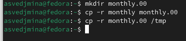
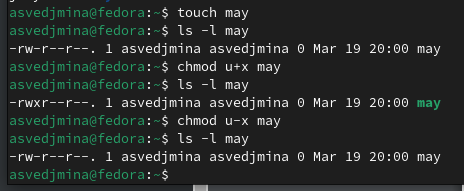
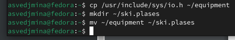
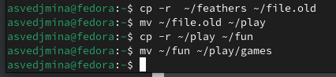
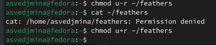

---
## Front matter
lang: ru-RU
title: Лабораторная работа №7
subtitle: операционные системы
author:
  - Ведьмина А.С.
institute:
  - Российский университет дружбы народов, Москва, Россия

## i18n babel
babel-lang: russian
babel-otherlangs: english

## Formatting pdf
toc: false
toc-title: Содержание
slide_level: 2
aspectratio: 169
section-titles: true
theme: metropolis
header-includes:
 - \metroset{progressbar=frametitle,sectionpage=progressbar,numbering=fraction}
 - '\makeatletter'
 - '\beamer@ignorenonframefalse'
 - '\makeatother'
---

# Информация

## Докладчик

:::::::::::::: {.columns align=center}
::: {.column width="70%"}

  * Ведьмина Александра Сергеевна
  * студентка
  * ФФМиЕН
  * Российский университет дружбы народов
  * [1132236003@rudn.ru](mailto:1132236003@rudn.ru)

:::
::: {.column width="30%"}

:::
::::::::::::::

# Цель работы

Ознакомление с файловой системой Linux, её структурой, именами и содержанием
каталогов. Приобретение практических навыков по применению команд для работы
с файлами и каталогами, по управлению процессами (и работами), по проверке использования диска и обслуживанию файловой системы.

# Теоретическое введение

## Теоретическое введение

Каждый файл или каталог имеет права доступа.
В сведениях о файле или каталоге указываются:
– тип файла (символ (-) обозначает файл, а символ (d) — каталог);
– права для владельца файла (r — разрешено чтение, w — разрешена запись, x — разрешено выполнение, - — право доступа отсутствует);
– права для членов группы (r — разрешено чтение, w — разрешена запись, x — разрешено
выполнение, - — право доступа отсутствует);
– права для всех остальных (r — разрешено чтение, w — разрешена запись, x — разрешено
выполнение, - — право доступа отсутствует).

Права доступа к файлу или каталогу можно изменить, воспользовавшись командой
chmod. Сделать это может владелец файла (или каталога) или пользователь с правами
администратора.

## Теоретическое введение

Файловая система в Linux состоит из фалов и каталогов. Каждому физическому носителю соответствует своя файловая система.
Существует несколько типов файловых систем. Перечислим наиболее часто встречающиеся типы:
– ext2fs (second extended filesystem);
– ext2fs (third extended file system);
– ext4 (fourth extended file system);
– ReiserFS;
– xfs;
– fat (file allocation table);
– ntfs (new technology file system).
Для просмотра используемых в операционной системе файловых систем можно воспользоваться командой mount без параметров.

# Выполнение лабораторной работы

## Выполнение лабораторной работы

Выполняю все примеры из первой части работы.

## Выполнение лабораторной работы

## Выполнение лабораторной работы

## Выполнение лабораторной работы

## Выполнение лабораторной работы

## Выполнение лабораторной работы

Скопирую файл /usr/include/sys/io.h в домашний каталог и называю его equipment. Создаю директорию ~/ski.plases, перемещаю в неё файл equipment.

## Выполнение лабораторной работы

Переименовываю файл ~/ski.plases/equipment в ~/ski.plases/equiplist. Создаю в домашнем каталоге файл abc1 и скопируйте его в каталог ~/ski.plases, называя equiplist2. Создаю каталог с именем equipment в каталоге ~/ski.plases. Перемещаю файлы ~/ski.plases/equiplist и equiplist2 в каталог ~/ski.plases/equipment.

## Выполнение лабораторной работы

Создаю каталог ~/newdir  и перемещаю его в ~/ski.plases, называю plans.

## Выполнение лабораторной работы

Создаю файлы australia, play, my_os, feathers и определяю опции команды chmod, которые нужны, чтобы присвоить этим файлам указанные права доступа.

## Выполнение лабораторной работы

Просмотриваю содержимое файла /etc/password.

## Выполнение лабораторной работы

Скопирую файл ~/feathers в файл ~/file.old, перемещаю файл ~/file.old в каталог ~/play. Скопирую каталог ~/play в каталог ~/fun, перемещаю каталог ~/fun в каталог ~/play и называю его games.

## Выполнение лабораторной работы

Лишаю владельца ~/feathers прав на чтение. Пытаюсь посмотреть этот файл, получаю ошибку, как и при попытке его копирования. Возвращаю права.

## Выполнение лабораторной работы

Лишаю владельца ~/play права на выполнение. При попытке перехода в этот каталог теперь получаю сообщение, что на это действие нет прав. Возвращаю права.

## Выполнение лабораторной работы

Читаю man по командам mount, fsck, mkfs, kill.

mount используется для подключения файловых систем к директории. 

## Выполнение лабораторной работы

fsck проверяет и исправляет целостность файловой системы. 

## Выполнение лабораторной работы

mkfs создаёт новую файловую систему на устройстве.

## Выполнение лабораторной работы

kill завершает работу процессов.

# Выводы

В ходе лаборторной работы я познакомилась с файловой системой Linux, её структурой, именами и содержанием каталогов, а также приобрела практические навыкы по применению команд для работы с файлами и каталогами.

