---
## Front matter
title: "Отчёт по лабораторной работе №7"
subtitle: "операционные системы"
author: "Ведьмина Александра Сергеевна"

## Generic otions
lang: ru-RU
toc-title: "Содержание"

## Bibliography
bibliography: bib/cite.bib
csl: pandoc/csl/gost-r-7-0-5-2008-numeric.csl

## Pdf output format
toc: true # Table of contents
toc-depth: 2
lof: true # List of figures
lot: true # List of tables
fontsize: 12pt
linestretch: 1.5
papersize: a4
documentclass: scrreprt
## I18n polyglossia
polyglossia-lang:
  name: russian
  options:
	- spelling=modern
	- babelshorthands=true
polyglossia-otherlangs:
  name: english
## I18n babel
babel-lang: russian
babel-otherlangs: english
## Fonts
mainfont: PT Serif
romanfont: PT Serif
sansfont: PT Sans
monofont: PT Mono
mainfontoptions: Ligatures=TeX
romanfontoptions: Ligatures=TeX
sansfontoptions: Ligatures=TeX,Scale=MatchLowercase
monofontoptions: Scale=MatchLowercase,Scale=0.9
## Biblatex
biblatex: true
biblio-style: "gost-numeric"
biblatexoptions:
  - parentracker=true
  - backend=biber
  - hyperref=auto
  - language=auto
  - autolang=other*
  - citestyle=gost-numeric
## Pandoc-crossref LaTeX customization
figureTitle: "Рис."
tableTitle: "Таблица"
listingTitle: "Листинг"
lofTitle: "Список иллюстраций"
lotTitle: "Список таблиц"
lolTitle: "Листинги"
## Misc options
indent: true
header-includes:
  - \usepackage{indentfirst}
  - \usepackage{float} # keep figures where there are in the text
  - \floatplacement{figure}{H} # keep figures where there are in the text
---

# Цель работы

Ознакомление с файловой системой Linux, её структурой, именами и содержанием
каталогов. Приобретение практических навыков по применению команд для работы
с файлами и каталогами, по управлению процессами (и работами), по проверке использования диска и обслуживанию файловой системы.

# Теоретическое введение

Для создания текстового файла можно использовать команду touch. Для просмотра файлов небольшого размера можно использовать команду cat. Для просмотра файлов постранично удобнее использовать команду less. 

Каждый файл или каталог имеет права доступа (табл. 5.1).
В сведениях о файле или каталоге указываются:
– тип файла (символ (-) обозначает файл, а символ (d) — каталог);
– права для владельца файла (r — разрешено чтение, w — разрешена запись, x — разрешено выполнение, - — право доступа отсутствует);
– права для членов группы (r — разрешено чтение, w — разрешена запись, x — разрешено
выполнение, - — право доступа отсутствует);
– права для всех остальных (r — разрешено чтение, w — разрешена запись, x — разрешено
выполнение, - — право доступа отсутствует).

Права доступа к файлу или каталогу можно изменить, воспользовавшись командой
chmod. Сделать это может владелец файла (или каталога) или пользователь с правами
администратора.

Файловая система в Linux состоит из фалов и каталогов. Каждому физическому носителю соответствует своя файловая система.
Существует несколько типов файловых систем. Перечислим наиболее часто встречающиеся типы:
– ext2fs (second extended filesystem);
– ext2fs (third extended file system);
– ext4 (fourth extended file system);
– ReiserFS;
– xfs;
– fat (file allocation table);
– ntfs (new technology file system).
Для просмотра используемых в операционной системе файловых систем можно воспользоваться командой mount без параметров.

# Выполнение лабораторной работы

Выполняю все примеры из первой части работы.

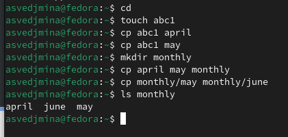{#fig:001 width=100%}

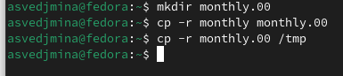{#fig:002 width=100%}

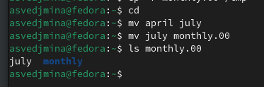{#fig:003 width=100%}

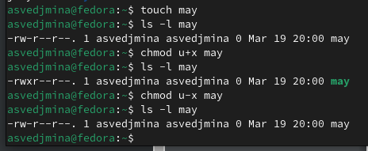{#fig:004 width=100%}

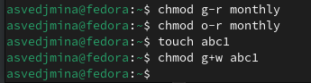{#fig:005 width=100%}

Скопирую файл /usr/include/sys/io.h в домашний каталог и называю его equipment. Создаю директорию ~/ski.plases, перемещаю в неё файл equipment.

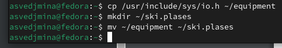{#fig:006 width=100%}

Переименовываю файл ~/ski.plases/equipment в ~/ski.plases/equiplist. Создаю в домашнем каталоге файл abc1 и скопируйте его в каталог ~/ski.plases, называя equiplist2. Создаю каталог с именем equipment в каталоге ~/ski.plases. Перемещаю файлы ~/ski.plases/equiplist и equiplist2 в каталог ~/ski.plases/equipment.

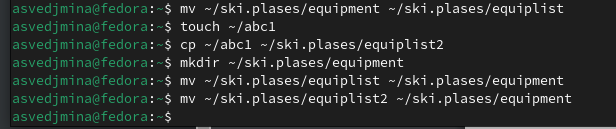{#fig:007 width=100%}

Создаю каталог ~/newdir  и перемещаю его в ~/ski.plases, называю plans.

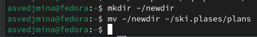{#fig:008 width=100%}

Создаю файлы australia, play, my_os, feathers и определяю опции команды chmod, которые нужны, чтобы присвоить этим файлам указанные права доступа.

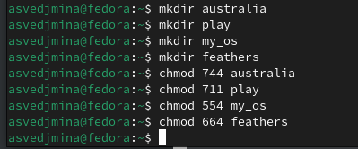{#fig:009 width=100%}

Просмотриваю содержимое файла /etc/password.

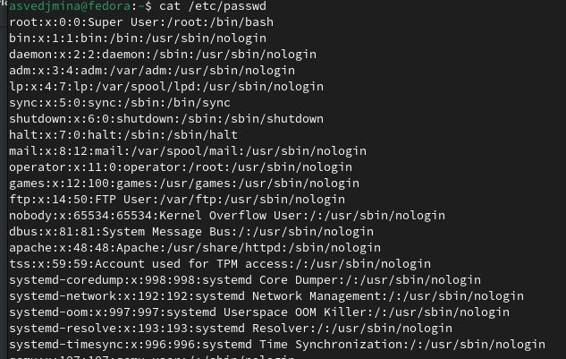{#fig:010 width=100%}

Скопирую файл ~/feathers в файл ~/file.old, перемещаю файл ~/file.old в каталог ~/play. Скопирую каталог ~/play в каталог ~/fun, перемещаю каталог ~/fun в каталог ~/play и называю его games.

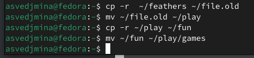{#fig:011 width=100%}

Лишаю владельца ~/feathers прав на чтение. Пытаюсь посмотреть этот файл, получаю ошибку, как и при попытке его копирования. Возвращаю права.

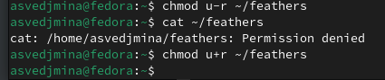{#fig:012 width=100%}

Лишаю владельца ~/play права на выполнение. При попытке перехода в этот каталог теперь получаю сообщение, что на это действие нет прав. Возвращаю права.

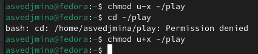{#fig:013 width=100%}

Читаю man по командам mount, fsck, mkfs, kill.

mount используется для подключения файловых систем к директории. 

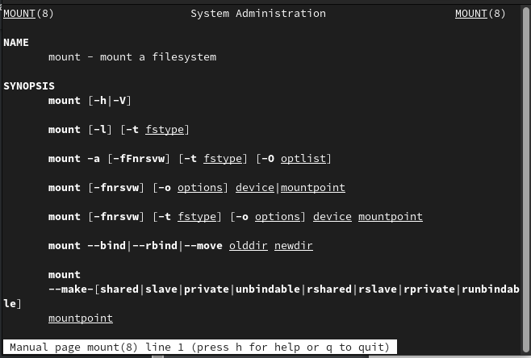{#fig:014 width=100%}

fsck проверяет и исправляет целостность файловой системы. 

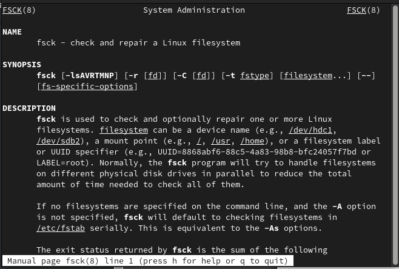{#fig:015 width=100%}

mkfs создаёт новую файловую систему на устройстве.

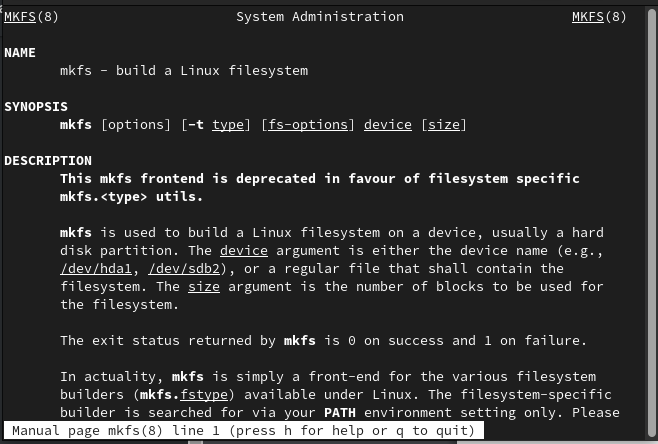{#fig:016 width=100%}

kill завершает работу процессов.

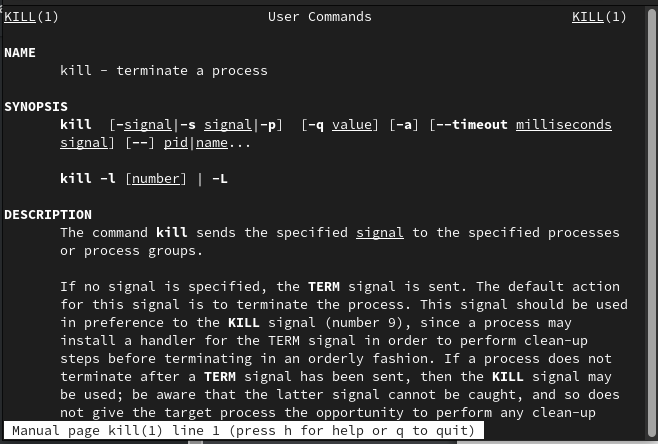{#fig:017 width=100%}

# Выводы

В ходе лаборторной работы я познакомилась с файловой системой Linux, её структурой, именами и содержанием каталогов, а также приобрела практические навыкы по применению команд для работы с файлами и каталогами.

# Ответы на контрольные вопросы

1. Характеристика файловых систем на жёстком диске:
ext4: Это распространенная файловая система в Linux, обеспечивающая хорошую производительность и надежность. Поддерживает файлы до 16 терабайт и объемы до 1 экзабайта.
2. swap: Файловая система swap используется для обмена данными между оперативной памятью и жестким диском, когда оперативная память заполнена.
/home: Это директория, где хранятся пользовательские файлы и настройки.
Общая структура файловой системы и директории первого уровня:
/: Корневая директория, содержащая все остальные директории и файлы.
/bin: Хранит основные исполняемые файлы.
/etc: Содержит конфигурационные файлы.
/home: Директория пользователей.
/var: Хранит переменные данные, такие как журналы и временные файлы.

3. Доступность файловой системы операционной системе:
Для доступности файловой системы операционной системе необходимо её смонтировать, что позволит системе видеть и работать с содержимым этой файловой системы.
4. Причины нарушения целостности файловой системы и способы восстановления:
Причины: сбои в питании, отключение системы без корректного выключения, ошибки ввода-вывода.
Восстановление: использование инструментов проверки целостности файловой системы, таких как fsck в Linux.
5. Создание файловой системы:
Файловая система создается с помощью утилиты mkfs, которая форматирует устройство для использования определенной файловой системой.
6. Просмотр текстовых файлов:
Для просмотра текстовых файлов в Linux используются команды cat, less, more, head, tail.
7. Основные возможности команды cp в Linux:
Команда cp используется для копирования файлов и директорий в Linux. Основные возможности включают копирование файлов, сохранение атрибутов, рекурсивное копирование директорий.
8. Основные возможности команды mv в Linux:
Команда mv используется для перемещения файлов и директорий в Linux. Основные возможности включают перемещение файлов, переименование файлов, перемещение с сохранением атрибутов.
9. Права доступа и их изменение:
Права доступа определяют, кто может читать, записывать или выполнять файлы. Изменить их можно с помощью команды chmod в Linux, где можно установить разрешения для владельца, группы и остальных пользователей.

