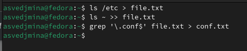
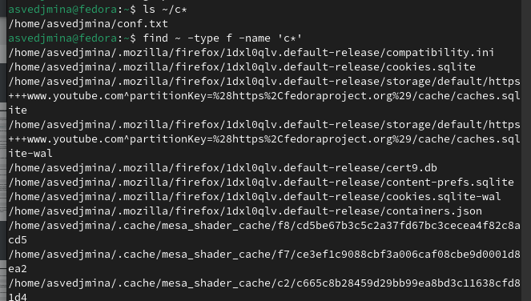
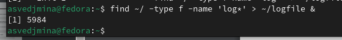
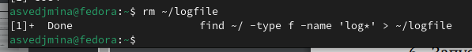
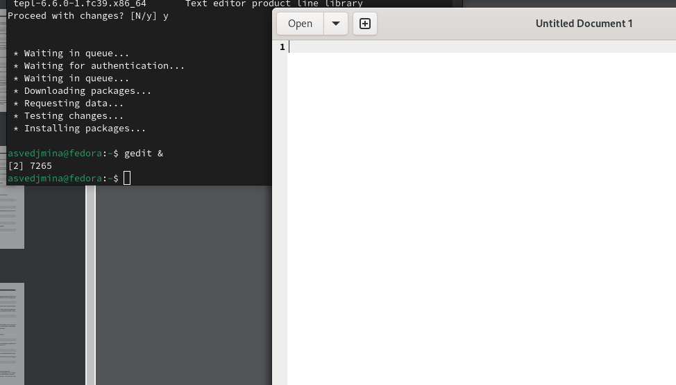
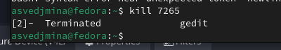
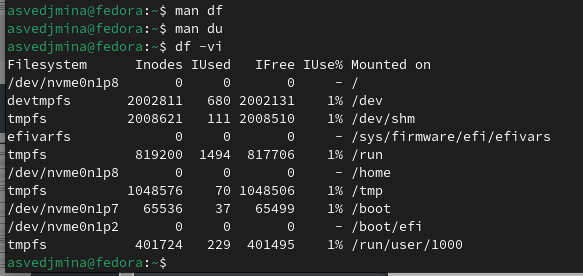
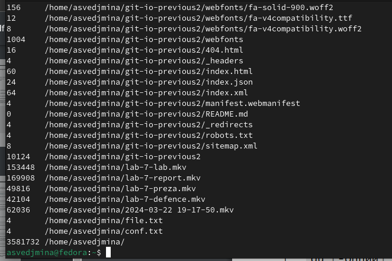
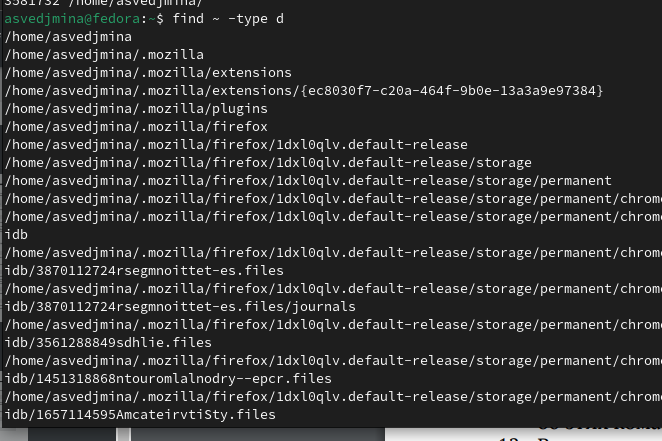

---
## Front matter
lang: ru-RU
title: Лабораторная работа №8
subtitle: операционные системы
author:
  - Ведьмина А.С.
institute:
  - Российский университет дружбы народов, Москва, Россия

## i18n babel
babel-lang: russian
babel-otherlangs: english

## Formatting pdf
toc: false
toc-title: Содержание
slide_level: 2
aspectratio: 169
section-titles: true
theme: metropolis
header-includes:
 - \metroset{progressbar=frametitle,sectionpage=progressbar,numbering=fraction}
 - '\makeatletter'
 - '\beamer@ignorenonframefalse'
 - '\makeatother'
---

# Информация

## Докладчик

:::::::::::::: {.columns align=center}
::: {.column width="70%"}

  * Ведьмина Александра Сергеевна
  * студентка
  * Российский университет дружбы народов
  * [1132236003@rudn.ru](mailto:1132236003@rudn.ru)

:::
::: {.column width="30%"}

:::
::::::::::::::

# Вводная часть

## Цель работы

Ознакомление с инструментами поиска файлов и фильтрации текстовых данных.
Приобретение практических навыков: по управлению процессами (и заданиями), по
проверке использования диска и обслуживанию файловых систем.

## Задание

1. Ознакомиться с теоретическим введением.
2. Выполнить задания.
3. Ответить на контрольные вопросы.

## Теоретическое введение

В системе по умолчанию открыто три специальных потока:
– stdin — стандартный поток ввода (по умолчанию: клавиатура), файловый дескриптор
0;
– stdout — стандартный поток вывода (по умолчанию: консоль), файловый дескриптор
1;
– stderr — стандартный поток вывод сообщений об ошибках (по умолчанию: консоль),
файловый дескриптор 2.
Большинство используемых в консоли команд и программ записывают результаты
своей работы в стандартный поток вывода stdout. Например, команда ls выводит в стандартный поток вывода (консоль) список файлов в текущей директории. Потоки вывода и ввода можно перенаправлять на другие файлы или устройства. Проще всего это делается с помощью символов >, >>, <, <<. 

# Выполнение лабораторной работы

## Выполнение лабораторной работы

Записываю в файл file.txt названия файлов, содержащихся в каталоге /etc. Дописываю в этот же файл названия файлов, содержащихся в вашем домашнем каталоге. Вывожу имена всех файлов из file.txt, имеющих расширение .conf, после чего записываю их в новый текстовой файл conf.txt.

## Выполнение лабораторной работы

Определяю, какие файлы в вашем домашнем каталоге имеют имена, начинавшиеся
с символа c

## Выполнение лабораторной работы

Вывожу имена файлов из каталога /etc, начинающиеся с символа h.

## Выполнение лабораторной работы

Запускаю в фоновом режиме процесс, который будет записывать в файл ~/logfile файлы, имена которых начинаются с log.

## Выполнение лабораторной работы

Удаляю файл ~/logfile.

## Выполнение лабораторной работы

Запускаю gedit в фоновом режиме.

## Выполнение лабораторной работы

Определяю идентификатор процесса gedit, используя команду ps, конвейер и фильтр grep.

## Выполнение лабораторной работы

Читаю о команде kill, после чего закрываю gedit с её помощью.

## Выполнение лабораторной работы

Выполняю команды df и du, предварительно получив более подробную информацию
об этих командах, с помощью команды man.

## Выполнение лабораторной работы

Выполнение du.

## Выполнение лабораторной работы

Вывожу имена всех директорий, имеющихся в вашем домашнем каталоге.

# Выводы

В ходе лабораторной работы я с инструментами поиска файлов и фильтрации текстовых данных.

