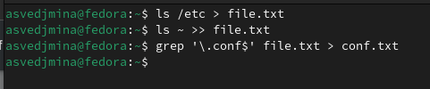
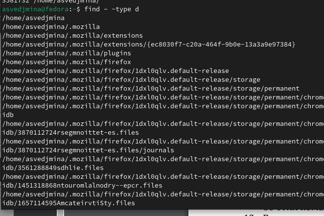

---
## Front matter
title: "Отчёт по лабораторной работе №8"
subtitle: "операционные системы"
author: "Ведьмина Александра Сергеевна"

## Generic otions
lang: ru-RU
toc-title: "Содержание"

## Bibliography
bibliography: bib/cite.bib
csl: pandoc/csl/gost-r-7-0-5-2008-numeric.csl

## Pdf output format
toc: true # Table of contents
toc-depth: 2
lof: true # List of figures
lot: true # List of tables
fontsize: 12pt
linestretch: 1.5
papersize: a4
documentclass: scrreprt
## I18n polyglossia
polyglossia-lang:
  name: russian
  options:
	- spelling=modern
	- babelshorthands=true
polyglossia-otherlangs:
  name: english
## I18n babel
babel-lang: russian
babel-otherlangs: english
## Fonts
mainfont: PT Serif
romanfont: PT Serif
sansfont: PT Sans
monofont: PT Mono
mainfontoptions: Ligatures=TeX
romanfontoptions: Ligatures=TeX
sansfontoptions: Ligatures=TeX,Scale=MatchLowercase
monofontoptions: Scale=MatchLowercase,Scale=0.9
## Biblatex
biblatex: true
biblio-style: "gost-numeric"
biblatexoptions:
  - parentracker=true
  - backend=biber
  - hyperref=auto
  - language=auto
  - autolang=other*
  - citestyle=gost-numeric
## Pandoc-crossref LaTeX customization
figureTitle: "Рис."
tableTitle: "Таблица"
listingTitle: "Листинг"
lofTitle: "Список иллюстраций"
lotTitle: "Список таблиц"
lolTitle: "Листинги"
## Misc options
indent: true
header-includes:
  - \usepackage{indentfirst}
  - \usepackage{float} # keep figures where there are in the text
  - \floatplacement{figure}{H} # keep figures where there are in the text
---

# Цель работы

Ознакомление с инструментами поиска файлов и фильтрации текстовых данных.
Приобретение практических навыков: по управлению процессами (и заданиями), по
проверке использования диска и обслуживанию файловых систем.

# Задание

1. Ознакомиться с теоретическим введением.
2. Выполнить задания.
3. Ответить на контрольные вопросы.

# Теоретическое введение

В системе по умолчанию открыто три специальных потока:
– stdin — стандартный поток ввода (по умолчанию: клавиатура), файловый дескриптор
0;
– stdout — стандартный поток вывода (по умолчанию: консоль), файловый дескриптор
1;
– stderr — стандартный поток вывод сообщений об ошибках (по умолчанию: консоль),
файловый дескриптор 2.
Большинство используемых в консоли команд и программ записывают результаты
своей работы в стандартный поток вывода stdout. Например, команда ls выводит в стандартный поток вывода (консоль) список файлов в текущей директории. Потоки вывода и ввода можно перенаправлять на другие файлы или устройства. Проще всего это делается с помощью символов >, >>, <, <<. 

# Выполнение лабораторной работы

Записываю в файл file.txt названия файлов, содержащихся в каталоге /etc. Дописываю в этот же файл названия файлов, содержащихся в вашем домашнем каталоге. Вывожу имена всех файлов из file.txt, имеющих расширение .conf, после чего записываю их в новый текстовой файл conf.txt.

{#fig:001 width=100%}

Определяю, какие файлы в вашем домашнем каталоге имеют имена, начинавшиеся
с символа c

{#fig:002 width=100%}

Вывожу имена файлов из каталога /etc, начинающиеся с символа h.

{#fig:003 width=100%}

Запускаю в фоновом режиме процесс, который будет записывать в файл ~/logfile файлы, имена которых начинаются с log.

{#fig:004 width=100%}

Удаляю файл ~/logfile.

{#fig:005 width=100%}

Запускаю gedit в фоновом режиме.

{#fig:006 width=100%}

Определяю идентификатор процесса gedit, используя команду ps, конвейер и фильтр grep.

{#fig:007 width=100%}

Читаю о команде kill, после чего закрываю gedit с её помощью.

{#fig:008 width=100%}

Выполняю команды df и du, предварительно получив более подробную информацию
об этих командах, с помощью команды man.

{#fig:009 width=100%}

{#fig:010 width=100%}

Вывожу имена всех директорий, имеющихся в вашем домашнем каталоге.

{#fig:011 width=100%}

# Выводы

В ходе лабораторной работы я с инструментами поиска файлов и фильтрации текстовых данных.

# Ответы на контрольные вопросы

1. Потоки ввода-вывода:
Некоторые известные потоки ввода-вывода:
stdin (стандартный ввод),
stdout (стандартный вывод),
stderr (стандартный вывод ошибок).
2. Разница между операциями > и >>:
Операция > используется для перенаправления вывода и перезаписи файла, тогда как операция >> используется для перенаправления вывода и добавления данных в конец файла.
3. Конвейер:
Конвейер (pipeline) - это механизм в UNIX-подобных системах, который позволяет объединять несколько команд таким образом, что вывод одной команды становится вводом для следующей.
4. Процесс и программа:
Процесс - это экземпляр программы, который выполняется в операционной системе. Программа - это набор инструкций, а процесс представляет собой выполнение этих инструкций.
5. PID и GID:
PID (Process ID) - это уникальный идентификатор процесса, а GID (Group ID) - идентификатор группы, к которой принадлежит пользователь.
6. Задачи и управление ими:
Задачи представляют собой выполняющиеся процессы. Команда ps позволяет просматривать информацию о процессах, а команда kill используется для завершения процессов.
7. Утилиты top и htop:
top и htop - это утилиты мониторинга процессов в Linux. top предоставляет информацию о процессах в реальном времени, а htop является улучшенной версией top с более дружественным интерфейсом.
8. Команда поиска файлов:
Команда поиска файлов find используется для поиска файлов и директорий на основе различных критериев. Пример использования:
find /home/user -name "*.txt"
9. Поиск файла по контексту:
Да, можно найти файл по контексту с помощью команды grep. Например:
grep "search term" filename
10. Определение объема свободной памяти на жёстком диске:
Для определения объема свободной памяти на жёстком диске используйте команду df.
11. Определение объема вашего домашнего каталога:
Для определения объема вашего домашнего каталога можно использовать команду du.
12. Удаление зависшего процесса:
Для удаления зависшего процесса можно использовать команду kill с указанием PID зависшего процесса.
