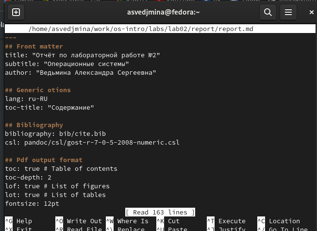
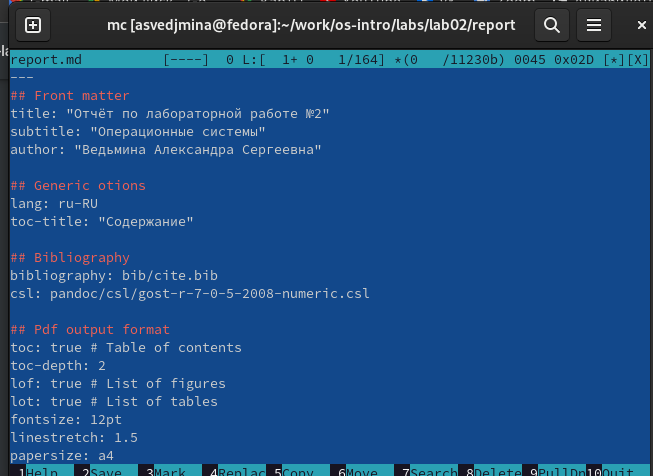
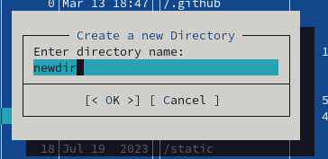
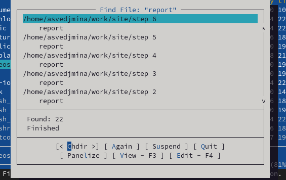
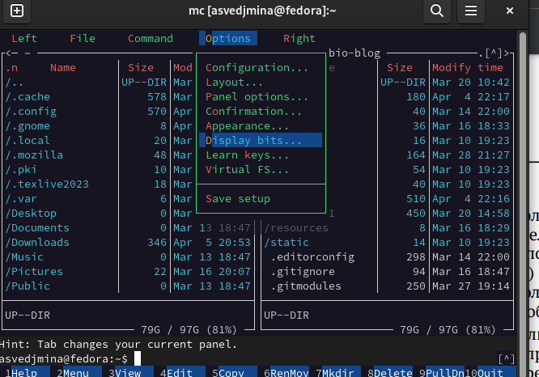
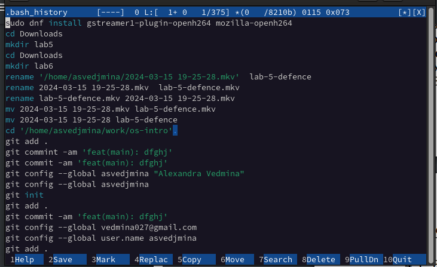

---
## Front matter
lang: ru-RU
title: Отчёт по лабораторной работе №9
subtitle: операционные системы
author:
  - Ведьмина А.С.
institute:
  - Российский университет дружбы народов, Москва, Россия

## i18n babel
babel-lang: russian
babel-otherlangs: english

## Formatting pdf
toc: false
toc-title: Содержание
slide_level: 2
aspectratio: 169
section-titles: true
theme: metropolis
header-includes:
 - \metroset{progressbar=frametitle,sectionpage=progressbar,numbering=fraction}
 - '\makeatletter'
 - '\beamer@ignorenonframefalse'
 - '\makeatother'
---

# Информация

## Докладчик

:::::::::::::: {.columns align=center}
::: {.column width="70%"}

  * Ведьмина Александра Сергеевна
  * студентка
  * ФФМиЕН
  * Российский университет дружбы народов
  * [1132236003@rudn.ru](mailto:1132236003@rudn.ru)
  * <https://asvedjmina.github.io/ru/>

:::
::: {.column width="30%"}

:::
::::::::::::::

# Цель работы

Освоение основных возможностей командной оболочки Midnight Commander. Приобретение навыков практической работы по просмотру каталогов и файлов; манипуляций
с ними.

# Задание

1. Ознакомиться с теоретическим введением.
2. Последовательно выполнить задания.

# Теоретическое введение

Командная оболочка — интерфейс взаимодействия пользователя с операционной системой и программным обеспечением посредством команд. Midnight Commander (или mc) — псевдографическая командная оболочка для UNIX/Linux систем. Для запуска mc необходимо в командной строке набрать mc и нажать Enter. Рабочее пространство mc имеет две панели, отображающие по умолчанию списки файлов двух каталогов.

Над панелями располагается меню, доступ к которому осуществляется с помощью клавиши F9 . Под панелями внизу расположены управляющие экранные кнопки, ассоциированные с функциональными клавишами F1 – F10. Над ними располагается командная строка, предназначенная для ввода команд.

# Выполнение лабораторной работы

## Выполнение лабораторной работы

Изучаю информацию о mc, вызвав в командной строке man mc.

{#fig:001 width=100%}

## Выполнение лабораторной работы

Открываю mc.

{#fig:002 width=100%}

## Выполнение лабораторной работы

Используя возможности подменю, смотрю содержимое текстового файла, редактрую его, создаю новый каталог.

{#fig:003 width=100%}

## Выполнение лабораторной работы

С помощью соответствующих средств подменю ищу файлы с названием report.

{#fig:004 width=100%}

## Выполнение лабораторной работы

Перехожу в домашний каталог, провожу анализ файла меню. После чего осваиваю опции в настройках.

{#fig:005 width=100%}

## Выполнение лабораторной работы

Создаю файл text.txt, открываю его в mc.

{#fig:006 width=100%}

## Выполнение лабораторной работы

Используя горячие клавиши, удаляю строку текста, копирую другой фрагмент на новую строку.

{#fig:007 width=100%}

## Выполнение лабораторной работы

После сохраняю файл, закрываю его. Активирую подсветку синтаксиса.

{#fig:008 width=100%}

# Выводы

В ходе этой лабораторной работы я освоила основные возможности командной оболочки Midnight Commander.
