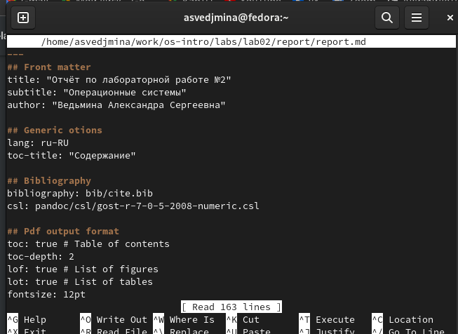
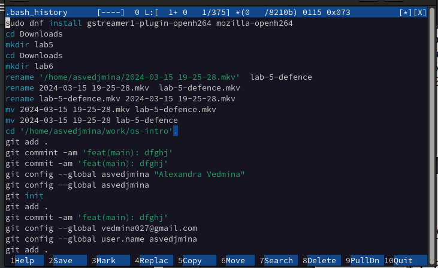

---
## Front matter
title: "Отчёт по лабораторной работе №9"
subtitle: "операционные системы"
author: "Ведьмина Александра Сергеевна"

## Generic otions
lang: ru-RU
toc-title: "Содержание"

## Bibliography
bibliography: bib/cite.bib
csl: pandoc/csl/gost-r-7-0-5-2008-numeric.csl

## Pdf output format
toc: true # Table of contents
toc-depth: 2
lof: true # List of figures
lot: true # List of tables
fontsize: 12pt
linestretch: 1.5
papersize: a4
documentclass: scrreprt
## I18n polyglossia
polyglossia-lang:
  name: russian
  options:
	- spelling=modern
	- babelshorthands=true
polyglossia-otherlangs:
  name: english
## I18n babel
babel-lang: russian
babel-otherlangs: english
## Fonts
mainfont: PT Serif
romanfont: PT Serif
sansfont: PT Sans
monofont: PT Mono
mainfontoptions: Ligatures=TeX
romanfontoptions: Ligatures=TeX
sansfontoptions: Ligatures=TeX,Scale=MatchLowercase
monofontoptions: Scale=MatchLowercase,Scale=0.9
## Biblatex
biblatex: true
biblio-style: "gost-numeric"
biblatexoptions:
  - parentracker=true
  - backend=biber
  - hyperref=auto
  - language=auto
  - autolang=other*
  - citestyle=gost-numeric
## Pandoc-crossref LaTeX customization
figureTitle: "Рис."
tableTitle: "Таблица"
listingTitle: "Листинг"
lofTitle: "Список иллюстраций"
lotTitle: "Список таблиц"
lolTitle: "Листинги"
## Misc options
indent: true
header-includes:
  - \usepackage{indentfirst}
  - \usepackage{float} # keep figures where there are in the text
  - \floatplacement{figure}{H} # keep figures where there are in the text
---

# Цель работы

Освоение основных возможностей командной оболочки Midnight Commander. Приобретение навыков практической работы по просмотру каталогов и файлов; манипуляций
с ними.

# Задание

1. Ознакомиться с теоретическим введением.
2. Последовательно выполнить задания.

# Теоретическое введение

Командная оболочка — интерфейс взаимодействия пользователя с операционной системой и программным обеспечением посредством команд. Midnight Commander (или mc) — псевдографическая командная оболочка для UNIX/Linux систем. Для запуска mc необходимо в командной строке набрать mc и нажать Enter. Рабочее пространство mc имеет две панели, отображающие по умолчанию списки файлов двух каталогов.

Над панелями располагается меню, доступ к которому осуществляется с помощью клавиши F9 . Под панелями внизу расположены управляющие экранные кнопки, ассоциированные с функциональными клавишами F1 – F10. Над ними располагается командная строка, предназначенная для ввода команд.

# Выполнение лабораторной работы

Изучаю информацию о mc, вызвав в командной строке man mc.

{#fig:001 width=100%}

Открываю mc.

{#fig:002 width=100%}

Используя возможности подменю, смотрю содержимое текстового файла, редактрую его, создаю новый каталог.

{#fig:003 width=100%}

С помощью соответствующих средств подменю ищу файлы с названием report.

{#fig:004 width=100%}

Перехожу в домашний каталог, провожу анализ файла меню. После чего осваиваю опции в настройках.

{#fig:005 width=100%}

Создаю файл text.txt, открываю его в mc.

{#fig:006 width=100%}

Используя горячие клавиши, удаляю строку текста, копирую другой фрагмент на новую строку.

{#fig:007 width=100%}

После сохраняю файл, закрываю его. 
Активирую подсветку синтаксиса.

{#fig:008 width=100%}

# Выводы

В ходе этой лабораторной работы я освоила основные возможности командной оболочки Midnight Commander.
