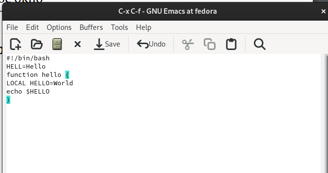

---
## Front matter
lang: ru-RU
title: Отчёт по лабораторной работе №11
subtitle: операционные системы
author:
  - Ведьмина А.С.
institute:
  - Российский университет дружбы народов, Москва, Россия

## i18n babel
babel-lang: russian
babel-otherlangs: english

## Formatting pdf
toc: false
toc-title: Содержание
slide_level: 2
aspectratio: 169
section-titles: true
theme: metropolis
header-includes:
 - \metroset{progressbar=frametitle,sectionpage=progressbar,numbering=fraction}
 - '\makeatletter'
 - '\beamer@ignorenonframefalse'
 - '\makeatother'
---

# Информация

## Докладчик

:::::::::::::: {.columns align=center}
::: {.column width="70%"}

  * Ведьмина Александра Сергеевна
  * студентка
  * ФФМиЕН
  * Российский университет дружбы народов
  * [1132236003@rudn.ru](mailto:1132236003@rudn.ru)
  * <https://asvedjmina.github.io/ru/>

:::
::: {.column width="30%"}

:::
::::::::::::::

# Цель работы

Познакомиться с операционной системой Linux. Получить практические навыки работы с редактором Emacs.

# Задание

1. Ознакомиться с теоретическим материалом.
2. Ознакомиться с редактором emacs.
3. Выполнить упражнения.

# Теоретическое введение

Emacs представляет собой мощный экранный редактор текста, написанный на языке
высокого уровня Elisp.

Буфер — объект, представляющий какой-либо текст.
Буфер может содержать что угодно, например, результаты компиляции программы
или встроенные подсказки. Практически всё взаимодействие с пользователем, в том
числе интерактивное, происходит посредством буферов.

Фрейм соответствует окну в обычном понимании этого слова. Каждый
фрейм содержит область вывода и одно или несколько окон Emacs.

## Теоретическое введение

Окно — прямоугольная область фрейма, отображающая один из буферов.
Каждое окно имеет свою строку состояния, в которой выводится следующая информация: название буфера, его основной режим, изменялся ли текст буфера и как далеко вниз
по буферу расположен курсор. Каждый буфер находится только в одном из возможных
основных режимов. Существующие основные режимы включают режим Fundamental
(наименее специализированный), режим Text, режим Lisp, режим С, режим Texinfo
и другие. Под второстепенными режимами понимается список режимов, которые включены в данный момент в буфере выбранного окна.

# Выполнение лабораторной работы

## Выполнение лабораторной работы

Открываю emacs.

## Выполнение лабораторной работы

Создаю файл lab07.sh и вставляю в него предложенный текст.

## Выполнение лабораторной работы

Сохраняю его. После вырезаю строку одной командой и вставляю её в конец файла.

## Выполнение лабораторной работы

Затем выделяю область текста и вставляю её в конец файла.

## Выполнение лабораторной работы

Отменяю последнее действие.

## Выполнение лабораторной работы

Перенос курсора в начало строки.

## Выполнение лабораторной работы

Перенос курсора в конец строки.

## Выполнение лабораторной работы

Вывожу список активных буферов на экран.

## Выполнение лабораторной работы

Делю фрейм на 4 части поэтапно.

## Выполнение лабораторной работы

Переключаюсь в режим поиска. Ищу слово "hello".

## Выполнение лабораторной работы

Перехожу в режим поиска строк по содержанию.

# Выводы

Я познакомилась с операционной системой Linux и получила практические навыки работы с редактором Emacs.

