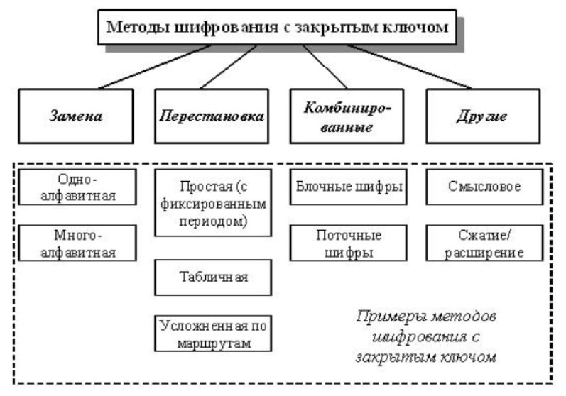

---
## Front matter
title: "Доклад по теме "Методы криптования на основе закрытого ключа" "
subtitle: "дисциплина: операционные системы"
author: "Ведьмина Александра Сергеевна"

## Generic otions
lang: ru-RU
toc-title: "Содержание"

## Bibliography
bibliography: bib/cite.bib
csl: pandoc/csl/gost-r-7-0-5-2008-numeric.csl

## Pdf output format
toc: true # Table of contents
toc-depth: 2
lof: true # List of figures
lot: true # List of tables
fontsize: 12pt
linestretch: 1.5
papersize: a4
documentclass: scrreprt
## I18n polyglossia
polyglossia-lang:
  name: russian
  options:
	- spelling=modern
	- babelshorthands=true
polyglossia-otherlangs:
  name: english
## I18n babel
babel-lang: russian
babel-otherlangs: english
## Fonts
mainfont: PT Serif
romanfont: PT Serif
sansfont: PT Sans
monofont: PT Mono
mainfontoptions: Ligatures=TeX
romanfontoptions: Ligatures=TeX
sansfontoptions: Ligatures=TeX,Scale=MatchLowercase
monofontoptions: Scale=MatchLowercase,Scale=0.9
## Biblatex
biblatex: true
biblio-style: "gost-numeric"
biblatexoptions:
  - parentracker=true
  - backend=biber
  - hyperref=auto
  - language=auto
  - autolang=other*
  - citestyle=gost-numeric
## Pandoc-crossref LaTeX customization
figureTitle: "Рис."
tableTitle: "Таблица"
listingTitle: "Листинг"
lofTitle: "Список иллюстраций"
lotTitle: "Список таблиц"
lolTitle: "Листинги"
## Misc options
indent: true
header-includes:
  - \usepackage{indentfirst}
  - \usepackage{float} # keep figures where there are in the text
  - \floatplacement{figure}{H} # keep figures where there are in the text
---

# Актуальность темы

В современном мире информационных технологий крайне важно следить за сохранностью своих данных. Использование нестойких шифров может способствовать утечке конфиденциальной информации.

# Объект и предмет исследования

В этой работе будут рассмотрены основные методы шифрования с закрытым ключом:

- Замена
- Перестановка
- Комбинированные
- Другие

# Практическая значимость работы

Практическую значимость исследования сложно недооценить. Шифрование данных имело место ещё задолго до появления компьютеров. Секретные переписки политических деятелей, карты, заговоры - во все времена люди старались придумать способы скрыть информацию от чужих глаз.

# Цель работы

Изучить различные методы криптования на основе закрытого ключа.

# Понятие криптования с закрытым ключом

Криптование - преобразование информации на основе секретного шифра с целью её защиты. Особенность закрытого ключа состоит в том, что только его владелец знает, по какому принципу зашифрованы данные, и может расшифровать их.

Известны разные методы шифрования с закрытыми ключом. На практике часто используются алгоритмы перестановки, подстановки, комбинированные методы.

{#fig:001 width=100%}

## Метод перестановки

Метод перестановки подразумевает перемену символов исходного текста местами между собой по определённому правилу. В целях повышения надёжности шифрования текст, зашифрованный таким образом, может быть зашифрован ещё раз с помощью другого метода. В таком случае получится комбинированный (композиционный) шифр.

## Метод замены

Методы замены бывают многоалфавитные и одноалфавитные. Они основаны на замене букв исходного текста символами из другого алфавита по определённому правилу. В пример можно привести шифр Цезаря. Гай Юлий Цезарь заменял одни буквы другими и использовал сдвиг на три символа. При шифровании буква верхнего ряда заменяется на соответствующую букву нижнего ряда. А при чтении, наоборот, буква из нижнего ряда заменяется буквой из верхнего.

Похожий способ шифрования был и на Руси, но назывался литереей или тарабарской грамотой (тарабарщиной). Его в своей переписке использовали Сергий Радонежский и митрополит Киприан.

##  Пропорциональные шифры

К одноалфавитным методам подстановки относятся пропорциональные или монофонические шифры, в которых уравнивается частота появления зашифрованных знаков для защиты от раскрытия с помощью частотного анализа. Для знаков, встречающихся часто, используется относительно большое число возможных эквивалентов. Для менее используемых исходных знаков может оказаться достаточным одного или двух эквивалентов. При шифровании замена для символа открытого текста выбирается либо случайным, либо определенным образом (например, по порядку).

Монофические шифры характеризуются тем, что количество символов замены в каждом массиве пропорционально частоте появления буквы в открытом тексте. В пропорциональных частоты всех символов шифрограммы примерно одинаковы.

Эти шифры подвержены одной и той же атаке — частотному анализу. А сам частотный анализ основан на том, что частота проявления разных символов шифротекста в той или иной мере соответствует частотам символов открытого текста, а потому на основе этого можно делать гипотезы.

## Блочное шифрование

Блочное шифрование - это один из видов симметричного шифрования. Называется он так, потому что работает с блоками: группами бит, фиксированной длины. Чтобы стало яснее, рассмотрим один из методов построения блочных шифров: сеть Фестеля. 

### Сеть Фестеля

Сеть Фестеля представляет собой конструкцию из ячеек. На вход каждой ячейки поступают данные и ключ. А на выходе каждой из них - изменённые данные и изменённый ключ. Чтобы зашифровать информацию ее разбивают на блоки фиксированной длины. Как правило, длина входного блока является степенью двойки.

Алгоритм шифрования:

- Каждый из блоков делится на два подблока одинакового размера — левый и правый.
- Правый подблок отдаётся функции.
- После чего умножается по модулю 2 (операция xor) с левым блоком.
- Полученный результат в следующем раунде будет играть роль правого подблока.
- Правый подблок (без изменений) выступит в роли левого подблока.

Поточный шифр: каждый символ открытого текста преобразуется в символ шифрованного текста в зависимости не только от использованного ключа, но и от его расположения в потоке открытого ключа.

# Выводы

Мы изучили различные методы криптования на основе закрытого ключа: замену, перестановку и комбинированные методы. 

# Список литературы{.unnumbered}

1. https://cryptoarm.ru/news/explanation-cryptography-simple/

2. https://intuit.ru/studies/courses/691/547/lecture/12373

3. https://habr.com/ru/articles/534236/
